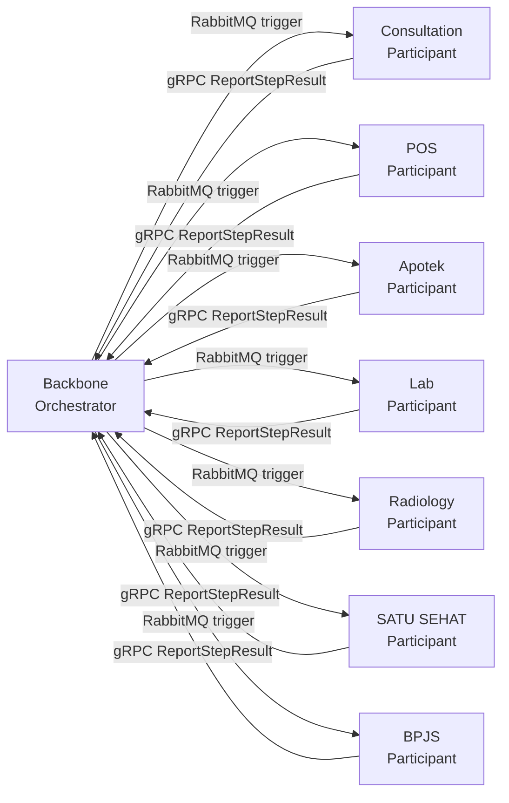

# Saga Event Backlog

**Version:** 1.0
**Date:** 05 March 2026
**Maintained by:** Alex, Abdul

---

# 1. Purpose

1.1 This document is the canonical list of all saga events in the WellMed system. It exists so that Abdul and the engineering team have a single place to see what needs to be built, in what order, and how complex each item is — independent of any one execution plan.

1.2 A saga in this system is any business operation that spans more than one service and requires compensation (rollback) if a step fails. Backbone is the sole orchestrator (ADR-005). Every other service — consultation, POS, apotek, lab, radiology, SATU SEHAT — is a participant.

1.3 This backlog feeds execution plans. When a saga is ready to build, create a plan at `kalpa-docs/plans/[saga-name]/[saga-name]-PLAN.md` and reference this doc.

---

# 2. Prerequisites

Before implementing any saga builder from this backlog, the following must be in place.

2.1 **Framework rework** (`saga-pattern-extended-PLAN.md`) — the backbone saga framework (`internal/saga/`) must be on the ADR-005 pattern: single non-blocking `Execute()`, RabbitMQ triggers, gRPC callbacks, `REJECTED` vs `FAILED` distinction, `RedisReplyStore`. Until this is done, new builders inherit the old blocking pattern and will need re-migration.

2.2 **`saga_steps` DB migration** — per-step state tracking table. Required for any saga that needs step-level visibility (all P0/P1 sagas qualify).

2.3 **SagaStatusService gateway route** — `GET /api/v1/saga/:saga_id/status`. Required for any saga where the frontend needs to poll for async completion (pharmacy sale, CreateVisit, any billing flow).

2.4 **Participant step consumer** — each target service must have a live `StepConsumer` with the relevant handler registered. Consultation's consumer is wired (Phase 2 complete). POS, apotek, lab, radiology need the same treatment when their sagas are built.

---

# 3. How to Read This Backlog

3.1 **Priority** — P0 = system cannot function without it, P1 = full clinical workflow requires it, P2 = important but deferrable, P3 = future.

3.2 **Mode** — ASYNC means the caller gets a `saga_id` immediately and polls `SagaStatusService`. Parallel means one or more steps fan out simultaneously (requires parallel step group support in the framework — see §2.1).

3.3 **Status** — `[ ]` not started, `[~]` in progress, `[x]` complete (backbone builder + all participant handlers live on dev).

3.4 **Compensation** — every saga with remote steps needs a compensation path. The notes column calls out non-obvious compensation requirements.

---

# 4. Category 1 — User-Generated Sagas

These are triggered by a user action and must compensate if any step fails.

## 4.1 Patient Lifecycle

| Status | Saga | Priority | Mode | Services | Notes |
|--------|------|----------|------|----------|-------|
| `[~]` | **CreatePatient** | P0 | ASYNC | backbone → satu-sehat | Exists; migrate to new framework (§2.1) |
| `[ ]` | **UpdatePatient** | P2 | ASYNC | backbone → satu-sehat re-sync | Open question: only needed if any downstream service caches patient fields. Per ADR-006 they should not — confirm before building. |
| `[ ]` | **MergePatient** | P3 | ASYNC | backbone + all services | Complex FK reassignment across all participant DBs. Design separately. |

## 4.2 Visit Lifecycle

| Status | Saga | Priority | Mode | Services | Notes |
|--------|------|----------|------|----------|-------|
| `[x]` | **CreateVisit** | P0 | ASYNC | backbone → consultation | Backbone builder + consultation handler complete. Pending E2E test on dev. |
| `[ ]` | **AddServiceToVisit** | P1 | ASYNC | backbone → pos | Adds an invoice line in POS for the new service. |
| `[ ]` | **RemoveServiceFromVisit** | P1 | ASYNC | backbone → pos → lab/radiology | If the service is a diagnostic order, must also cancel the pending order. |
| `[ ]` | **CancelVisit** | P1 | ASYNC + Parallel | backbone → pos + lab + radiology + apotek | Most complex saga in the system. Requires parallel fan-out (§2.1). Compensation is conditional: if a service is already in progress or complete, write-off rather than cancel. Build last in P1 group. Open question: does CancelVisit need a distinct "patient walk-out" visit status, or is "cancelled with write-off" sufficient? |
| `[ ]` | **DischargePatient** | P1 | ASYNC | backbone → pos (finalize) → satu-sehat (encounter) → bpjs (if applicable) | SATU SEHAT encounter submission deadline pressure. |

## 4.3 Clinical / Doctor

| Status | Saga | Priority | Mode | Services | Notes |
|--------|------|----------|------|----------|-------|
| `[ ]` | **DoctorSignOff** | P0 | ASYNC | backbone (lock) → consultation (finalize SOAP) → pos (trigger billing) → satu-sehat | Central to clinical workflow. Backbone locks the record first (local step), then fires remote steps. Cannot be compensated after pos billing is triggered — design must account for this hard boundary. |
| `[ ]` | **CreateLabOrder** | P1 | ASYNC | backbone → lab service → pos (add line) | Depends on lab service having a StepConsumer. |
| `[ ]` | **CancelLabOrder** | P1 | ASYNC | backbone → lab service → pos (remove line) | |
| `[ ]` | **CreateRadiologyOrder** | P1 | ASYNC | backbone → radiology service → pos (add line) | Depends on radiology service StepConsumer. |
| `[ ]` | **CancelRadiologyOrder** | P1 | ASYNC | backbone → radiology service → pos (remove line) | |
| `[ ]` | **LabResultReceived** | P2 | ASYNC | lab → backbone → consultation (notify) | Append-only record; flag as erroneous rather than delete if wrong. |
| `[ ]` | **RadiologyResultReceived** | P2 | ASYNC | radiology → backbone → consultation | Same pattern as LabResultReceived. |

## 4.4 Pharmacy (3 separate events)

These are three distinct workflows, not one. Do not collapse them.

| Status | Saga | Priority | Mode | Services | Notes |
|--------|------|----------|------|----------|-------|
| `[ ]` | **CreatePrescription** | P1 | ASYNC | backbone (record) → consultation (link to encounter) → apotek (dispensing queue) | Initiated by doctor at sign-off. May be partially pre-built in backbone before the saga triggers. |
| `[ ]` | **CancelPrescription** | P1 | ASYNC | backbone → apotek (remove from queue) | Only valid if not yet dispensed. Compensation is a no-op if dispensing already started — must check apotek state first. |
| `[ ]` | **DispensePrescription** | P1 | ASYNC | apotek (deduct stock, mark dispensed) → backbone (status update) → pos (create invoice line) | Initiated by pharmacist, not doctor. Apotek is the triggering service here — different from the pattern where backbone always initiates. |
| `[~]` | **PharmacySale** | P0 | ASYNC (after rework) | backbone → pos | Exists; currently blocking/sync. Migrate to non-blocking pattern; frontend polls `SagaStatusService`. |
| `[ ]` | **CancelPharmacySale** | P1 | ASYNC | backbone → pos (void) → apotek (restock if undispensed) | Apotek restock is conditional on whether dispensing occurred. |

## 4.5 Billing and Payments

| Status | Saga | Priority | Mode | Services | Notes |
|--------|------|----------|------|----------|-------|
| `[ ]` | **CreateInvoice** | P1 | ASYNC | backbone → pos | |
| `[ ]` | **CancelInvoice** | P1 | ASYNC | backbone → pos (void) → apotek (restock) → lab (mark unbilled) | Multi-service compensation; complexity depends on how far along each service is. |
| `[ ]` | **ProcessPayment** | P1 | ASYNC | pos → backbone (update visit status) → bpjs (if insurance) | POS initiates; BPJS submission is conditional on insurance type. |
| `[ ]` | **RefundPayment** | P2 | ASYNC | pos → backbone → bpjs (reverse claim) | |
| `[ ]` | **CreateReferral** | P2 | ASYNC | backbone → satu-sehat | |

---

# 5. Category 2 — System Activity Sagas

Triggered by system events, scheduled jobs, or internal service transitions rather than direct user actions.

| Status | Saga | Priority | Mode | Description |
|--------|------|----------|------|-------------|
| `[ ]` | **PublishItemCatalog** | P1 | ASYNC | Item created/updated in backbone → pos + apotek + lab + radiology. Fan-out to multiple participants but no compensation needed (idempotent publish). |
| `[ ]` | **SatuSehatPatientSync** | P1 | ASYNC | backbone → satu-sehat API. Needs saga tracking for retry/DLQ visibility. |
| `[ ]` | **SatuSehatEncounterSubmit** | P1 | ASYNC | Post-discharge encounter bundle to satu-sehat. Government deadline pressure. |
| `[ ]` | **UpdatePricelist** | P2 | ASYNC | Pricelist activation → push to pos → notify active visits. |
| `[ ]` | **DeactivateItem** | P2 | ASYNC | Remove from all service catalogs; flag open invoice lines. |
| `[ ]` | **CreateEmployee** | P2 | ASYNC | backbone → consultation (practitioner profile) → pos (cashier account if applicable). |
| `[ ]` | **UpdateEmployee** | P2 | ASYNC | backbone → all services holding a practitioner_id reference. |
| `[ ]` | **DeactivateEmployee** | P2 | ASYNC | backbone → reassign open visits → consultation → pos. |
| `[ ]` | **CreateUserAccount** | P2 | ASYNC | backbone → credential email → service-specific user stores. |
| `[ ]` | **DeactivateUserAccount** | P2 | ASYNC | backbone → Redis JWT revocation → all services. |
| `[ ]` | **BpjsClaimSubmission** | P2 | ASYNC | backbone → bpjs (validate → submit → poll). |
| `[ ]` | **BpjsClaimRejectionHandling** | P2 | ASYNC | bpjs rejection → backbone (flag visit) → notify staff. |
| `[ ]` | **StockAdjustment** | P2 | ASYNC | backbone/warehouse → apotek → pos. |
| `[ ]` | **TenantProvisioning** | P2 | ASYNC | HQ → create DB + schemas → seed → create admin → welcome email. |
| `[ ]` | **TenantSchemaYearRollover** | P2 | ASYNC | Year change → new year schema → migrate active records → verify. |

---

# 6. Category 3 — Migration Sagas

These are one-time or periodic operational jobs that benefit from saga-style tracking (retry, DLQ, progress visibility) but do not require compensation in the traditional sense — they are idempotent forward and skip-and-log on row-level failure. The `Checkpoint` step type for these is deferred until the framework is stable.

| Status | Saga | Description |
|--------|------|-------------|
| `[ ]` | **BulkPatientImport** | Import from external system. Idempotent forward; skip-and-log on row failure. |
| `[ ]` | **ServiceExtractionMigration** | Dual-write period → cutover → verify → prune backbone copy. Needed for each new service extraction (lab, radiology, apotek). |
| `[ ]` | **BpjsHistoricalSync** | Backfill historical BPJS claims. Idempotent check before submit. |
| `[ ]` | **SatuSehatHistoricalSync** | Backfill patient IHS numbers and encounter history. |
| `[ ]` | **PricelistMigration** | Old pricing model → ItemCatalog. Verify before commit. |
| `[ ]` | **DataReconciliation** | Periodic backbone vs service data check; flag discrepancies. Runs on a schedule. |

---

# 7. Build Sequence

7.1 The order below is the recommended sequence. It is not a strict dependency chain — items in the same tier can be parallelised — but later tiers assume earlier ones are stable.

7.1.1 **Tier 0 — Framework (blocks everything else).** Complete `saga-pattern-extended-PLAN.md`: non-blocking orchestrator, RedisReplyStore, `saga_steps` migration, `SagaStatusService` gateway route.

7.1.2 **Tier 1 — Core clinical flow (P0).** CreateVisit (builder done, handler done — pending E2E), DoctorSignOff, PharmacySale rework, CreatePatient migration.

7.1.3 **Tier 2 — Full visit lifecycle (P1).** AddServiceToVisit, RemoveServiceFromVisit, DischargePatient, CreatePrescription / DispensePrescription / CancelPrescription, CreateInvoice, ProcessPayment, CreateLabOrder / CreateRadiologyOrder, PublishItemCatalog, SatuSehatPatientSync.

7.1.4 **Tier 3 — Compensation completeness (P1, complex).** CancelVisit (parallel fan-out, conditional compensation — build last), CancelPharmacySale, CancelInvoice, CancelLabOrder / CancelRadiologyOrder.

7.1.5 **Tier 4 — P2 and government integration.** BPJS, SATU SEHAT historical sync, employee/user lifecycle, tenant provisioning.

7.1.6 **Tier 5 — Migration sagas.** Schedule when each service extraction plan begins.

---

# 8. Open Questions

8.1 **UpdatePatient saga needed?** Per ADR-006, downstream services reference patient by ID only and must not cache patient fields. If that constraint holds, UpdatePatient does not need a saga — backbone updates its own store and nothing downstream has stale data. Confirm with Abdul before scheduling. `@Abdul`

8.2 **CancelVisit: walk-out status.** Does CancelVisit need a distinct "patient walk-out" status on the visit record, or is "cancelled with write-off" sufficient for the clinical and billing workflows? `@Abdul`

8.3 **DispensePrescription initiator.** Apotek initiates this saga, not backbone — backbone is a participant receiving a callback. This inverts the normal pattern. Confirm whether apotek will call backbone's `ExecuteSaga` endpoint directly, or whether backbone polls apotek state. `@Abdul`

---

# Edit Log

| Version | Date | Author | Changes |
|---------|------|--------|---------|
| 1.0 | 05 March 2026 | Alex + Claude | Initial version. Extracted from `saga-pattern-extended-PLAN.md` §3 and `wild-booping-dolphin.md` plan context. Added build sequence, open questions, participant topology diagram, and framework prerequisites. |
