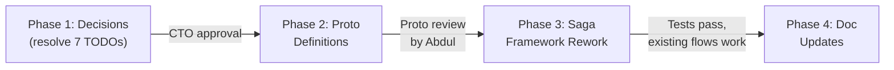
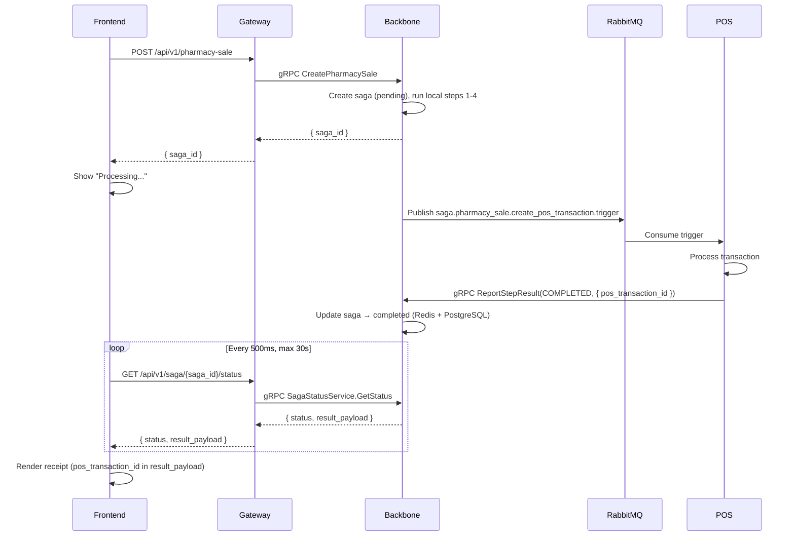
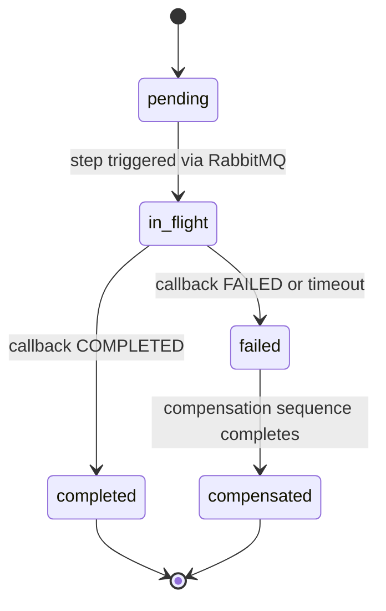
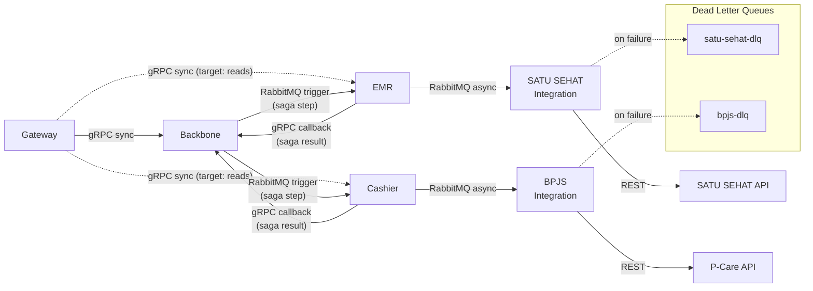

# PRD: Saga Pattern Extended — Architecture Alignment (ADR-002/005/006)

**Version:** 1.0
**Date:** 04 March 2026
**Status:** Draft — Pending CTO Review
**Maintained by:** Alex

---

# 1. Problem Statement

1.1 Three ADRs were accepted on March 3–4, 2026: ADR-002 (Consultation extraction), ADR-005 (Saga orchestration pattern), and ADR-006 (Domain and service boundaries). Together they redefine how Backbone, modules, and inter-service communication work. The existing saga framework code, proto definitions, and architecture documentation are now inconsistent with these decisions.

1.2 Seven open TODOs across ADR-005 (4 items) and ADR-006 (3 items) block implementation. No code or documentation changes should proceed until these are resolved with concrete, CTO-approved proposals.

1.3 This PRD resolves all seven TODOs, inventories every code and document change required, defines proto contracts, and sequences the work into four gated phases. It is the single reference for Hamzah's review before implementation begins.

1.4 **Consultation extraction is out of scope** — a separate plan exists at `kalpa-docs/plans/consultation-extraction/Consultation-extraction-PLAN.md`.

---

# 2. Users and Goals

| User | Role | Goal |
|------|------|------|
| Hamzah | CTO | Approve TODO resolutions and phase plan before code ships. Verify architectural consistency. |
| Abdul | Lead Backend | Review proto definitions, implement saga framework rework, validate backward compatibility. |
| Alex | CEO / Infra Lead | Author doc updates, coordinate phasing, ensure PRD completeness. |
| Frontend team | Consumers | Understand pharmacy sale async flow change (polling replaces sync response). |

---

# 3. Requirements

## 3.1 Phase Overview



3.1.1 Decisions gate code. Proto shapes gate implementation. Code must settle before docs describe it.

| Phase | Scope | Gate |
|-------|-------|------|
| 1. Decisions | Resolve 7 ADR TODOs with concrete proposals | CTO approval |
| 2. Proto Definitions | `SagaCallbackService`, `CanonicalVisitService`, `SagaStatusService` protos | Proto review by Abdul |
| 3. Saga Framework Rework | Refactor backbone saga internals to match ADR-005, add async pharmacy flow | Tests pass, existing flows work on dev |
| 4. Doc Updates | Update `wellmed-system-architecture.md` and `services/backbone.md` | CTO doc review |

---

## 3.2 Phase 1: Decisions — TODO Resolutions

3.2.1 Each proposal below resolves one open TODO from ADR-005 or ADR-006. CTO approves or modifies at review. No TODO remains open after this PRD is approved.

### 3.2.2 Retry Backoff Strategy

**Resolves:** ADR-005 §3.3 — "Define retry backoff strategy and max retry count per saga step type."

3.2.2.1 Three step categories with distinct retry profiles. All use exponential backoff with 20% jitter and per-retry caps to bound total elapsed time.

| Category | Base Delay | Max Retries | Per-Retry Cap | Max Elapsed | Examples |
|----------|-----------|-------------|---------------|-------------|---------|
| **internal-fast** | 1s | 5 | 16s | ~31s | Backbone → Consultation, Backbone → Cashier |
| **external-integration** | 5s | 8 | 55s | ~5min | Backbone → SATU SEHAT (async saga), Backbone → BPJS |
| **compensation** | 2s | 10 | 30s | ~3min | Any compensation step (reverse operations) |

3.2.2.2 Compensation gets more retries than forward steps because a partially compensated saga is worse than a slow compensation. The higher retry count reflects this: if compensation fails after 10 retries, the saga enters a `failed` terminal state and requires manual intervention.

3.2.2.3 Jitter formula: `delay = base * 2^attempt * (1 + random(-0.2, 0.2))`, capped at the per-retry cap.

### 3.2.3 Timeout Thresholds

**Resolves:** ADR-005 §3.3 — "Define timeout thresholds per step before compensation is triggered."

| Category | Step Timeout | Behavior on Timeout |
|----------|-------------|---------------------|
| **internal-fast** | 30s | Triggers compensation |
| **external-integration** | 300s (5 min) | Triggers compensation |
| **compensation** | 60s per step | Logs error, retries per §3.2.2 profile |

3.2.3.1 Three distinct timeout outcomes:

| Trigger | Backbone Action |
|---------|----------------|
| Step times out (no callback received) | Start compensation sequence for completed steps |
| Callback reports `FAILED` (business rejection) | Start compensation sequence for completed steps |
| Callback reports `REJECTED` (malformed payload) | Retry the step (infra error, not business logic). After max retries, mark saga as `failed` — no compensation, requires investigation |

3.2.3.2 The REJECTED distinction is critical. A REJECTED callback means Backbone composed a bad payload — compensation would undo valid work for an infra problem. Instead, Backbone retries until the payload issue is fixed or retries exhaust.

### 3.2.4 RabbitMQ Naming Convention

**Resolves:** ADR-005 §5.5 — "Define standard RabbitMQ exchange and routing key naming convention for saga step triggers."

3.2.4.1 Convention:

| Element | Pattern | Example |
|---------|---------|---------|
| Exchange | `wellmed.saga` | `wellmed.saga` |
| Routing key | `saga.{saga_type}.{step_name}.{trigger\|compensate}` | `saga.pharmacy_sale.create_pos_transaction.trigger` |
| Queue | Same as routing key | `saga.pharmacy_sale.create_pos_transaction.trigger` |
| Dead letter exchange | `dlx.wellmed.saga` | `dlx.wellmed.saga` |
| Dead letter queue | `dlx.{routing_key}` | `dlx.saga.pharmacy_sale.create_pos_transaction.trigger` |

3.2.4.2 The routing key encodes saga type, step name, and direction (trigger vs compensate). This is sufficient for routing, filtering in RabbitMQ management UI, and log correlation.

3.2.4.3 All saga-related RabbitMQ traffic uses a single topic exchange (`wellmed.saga`). Queues bind with their routing key pattern. This avoids exchange proliferation as saga types grow.

### 3.2.5 SagaCallbackService Proto Contract

**Resolves:** ADR-005 §5.6 — "Define the gRPC callback endpoint contract in Backbone that all modules use to respond."

3.2.5.1 Single method: `ReportStepResult`. All modules call this one endpoint to respond to any saga step. Backbone routes internally based on `saga_id` and `step_id`.

3.2.5.2 Status enum distinguishes three outcomes:

| Status | Meaning | Backbone Action |
|--------|---------|----------------|
| `STEP_STATUS_COMPLETED` | Step succeeded | Advance to next step or complete saga |
| `STEP_STATUS_FAILED` | Business logic rejection (e.g., insufficient stock) | Trigger compensation for completed steps |
| `STEP_STATUS_REJECTED` | Malformed payload (infra error) | Retry step, no compensation |

3.2.5.3 Full proto definition in §3.3.1.

### 3.2.6 Module Validation Requirements

**Resolves:** ADR-006 §3.3 — "Define validation requirements for module step handlers."

3.2.6.1 Modules must validate three things on every saga step payload:

| Validation | Example | On Failure |
|-----------|---------|-----------|
| Required fields present | `saga_id`, `step_id`, `patient_id` missing | Return `REJECTED` |
| Field types correct | `quantity` is string instead of int | Return `REJECTED` |
| Local referential integrity | `patient_id` references non-existent patient in module's view | Return `FAILED` |

3.2.6.2 The distinction: **REJECTED** = the payload is structurally broken (Backbone composed it wrong, or serialization failed). **FAILED** = the payload is well-formed but violates a business rule (patient doesn't exist, stock is insufficient, etc.). Backbone treats these differently per §3.2.3.1.

3.2.6.3 Modules must include `error_code` and `error_message` in the callback for both REJECTED and FAILED. Error codes follow the pattern `{MODULE}_{ERROR_TYPE}` (e.g., `POS_INSUFFICIENT_STOCK`, `CONSULTATION_PATIENT_NOT_FOUND`).

### 3.2.7 Reference Field Naming Convention

**Resolves:** ADR-006 §5.4 — "Document the naming convention for reference fields across modules."

3.2.7.1 Two patterns:

| Pattern | When | Example |
|---------|------|---------|
| `{entity}_id` | Simple FK to one entity type | `patient_id`, `visit_id`, `employee_id` |
| `reference_id` + `reference_type` | Polymorphic reference to multiple entity types | POS line item → `reference_id` + `reference_type` ("visit" or "walk_in") |

3.2.7.2 Proto field annotation for discoverability:

```protobuf
string patient_id = 3;    // ref: backbone.patient
string visit_id = 4;      // ref: consultation.visit_patient
string reference_id = 5;  // ref: polymorphic — see reference_type
string reference_type = 6; // "visit" | "walk_in"
```

3.2.7.3 The `// ref:` comment is a convention, not enforced by tooling. It tells developers (and AI context windows) where the ID points. Format: `// ref: {service}.{entity}` for simple FKs, `// ref: polymorphic — see {companion_field}` for polymorphic.

### 3.2.8 Canonical Model Criteria

**Resolves:** ADR-006 §5.5 — "Establish criteria for what qualifies as a Backbone-level canonical domain model."

3.2.8.1 Three-part rule. All three must be true for an entity to qualify as a Backbone canonical model:

| Criterion | Test |
|-----------|------|
| **Multi-service reference** | Entity is referenced by ID in 2+ services |
| **Business-wide subject** | Entity is a subject of the business as a whole, not a workflow artifact of one module |
| **Consistency-critical** | Divergent copies across services would create a data integrity problem |

3.2.8.2 Current canonical models: `patient`, `user`, `employee`. These pass all three tests. `item` is borderline (used by Pharmacy and Cashier) but fails test 2 — it is an inventory concept, not a business-wide subject. It stays module-local for now.

3.2.8.3 When a developer proposes a new canonical model, they must justify all three criteria in a brief (2–3 sentences per criterion). CTO approves. This prevents canonical model creep.

### 3.2.9 Phase 1 Tasks

- [ ] 3.2.9.1 Review all 7 proposals (§3.2.2–§3.2.8) — @Hamzah
- [ ] 3.2.9.2 Incorporate CTO feedback and finalize — @Alex

**Acceptance criteria:** All 7 TODOs have concrete, CTO-approved resolutions. No open items remain in ADR-005 or ADR-006.

---

## 3.3 Phase 2: Proto Definitions

### 3.3.1 saga_callback.proto

3.3.1.1 Location: `wellmed-backbone/proto/saga_callback.proto`

```protobuf
syntax = "proto3";

package saga.callback.v1;

option go_package = "github.com/ingarso/wellmed-backbone/proto/saga/callback/v1";

// SagaCallbackService is the single gRPC endpoint that all modules
// call to report saga step results back to Backbone.
service SagaCallbackService {
  // ReportStepResult delivers the outcome of a saga step.
  // Modules call this after processing a RabbitMQ-triggered step.
  rpc ReportStepResult(StepResultRequest) returns (StepResultResponse);
}

enum StepStatus {
  STEP_STATUS_UNSPECIFIED = 0;
  STEP_STATUS_COMPLETED = 1;   // Step succeeded — advance saga
  STEP_STATUS_FAILED = 2;      // Business logic rejection — trigger compensation
  STEP_STATUS_REJECTED = 3;    // Malformed payload — retry, no compensation
}

message StepResultRequest {
  string saga_id = 1;           // ref: backbone.saga
  string step_id = 2;           // Unique step identifier within saga
  StepStatus status = 3;
  bytes payload = 4;            // JSON-encoded step result (e.g., { "pos_transaction_id": "..." })
  string error_code = 5;        // Required if FAILED or REJECTED (e.g., POS_INSUFFICIENT_STOCK)
  string error_message = 6;     // Human-readable error detail
  string idempotency_key = 7;   // Prevents duplicate processing of the same callback
  string tenant = 8;            // Tenant identifier for DB routing
}

message StepResultResponse {
  bool accepted = 1;            // true if callback was processed; false if duplicate
}
```

### 3.3.2 canonical_visit.proto (stub)

3.3.2.1 Location: `wellmed-backbone/proto/canonical_visit.proto`

3.3.2.2 This is a stub. The Consultation extraction Phase 2 plan refines the FHIR-shaped payload. The interface shape is defined now so Backbone can register the gRPC service.

```protobuf
syntax = "proto3";

package canonical.visit.v1;

option go_package = "github.com/ingarso/wellmed-backbone/proto/canonical/visit/v1";

// CanonicalVisitService receives the final visit record from Consultation
// on doctor sign-off. This is the one legitimate Consultation → Backbone call.
// See ADR-002 §2.4.
service CanonicalVisitService {
  rpc WriteVisitRecord(WriteVisitRecordRequest) returns (WriteVisitRecordResponse);
}

message WriteVisitRecordRequest {
  string visit_id = 1;         // ref: consultation.visit_patient
  string patient_id = 2;       // ref: backbone.patient
  string tenant = 3;
  bytes fhir_payload = 4;      // FHIR-shaped canonical record — schema TBD in Phase 2
}

message WriteVisitRecordResponse {
  bool accepted = 1;
  string canonical_record_id = 2;
}
```

### 3.3.3 saga_status.proto

3.3.3.1 Location: `wellmed-backbone/proto/saga_status.proto`

3.3.3.2 Used by Gateway for the pharmacy sale async polling endpoint (§3.4.4).

```protobuf
syntax = "proto3";

package saga.status.v1;

option go_package = "github.com/ingarso/wellmed-backbone/proto/saga/status/v1";

// SagaStatusService exposes saga state for polling.
// Gateway calls this for the /api/v1/saga/:saga_id/status endpoint.
service SagaStatusService {
  rpc GetStatus(GetStatusRequest) returns (GetStatusResponse);
}

message GetStatusRequest {
  string saga_id = 1;
  string tenant = 2;
}

message GetStatusResponse {
  string saga_id = 1;
  string status = 2;           // pending | in_flight | completed | failed | compensated
  bytes result_payload = 3;    // JSON — populated on completed (e.g., { "pos_transaction_id": "..." })
  string error_code = 4;       // Populated on failed
  string error_message = 5;    // Populated on failed
}
```

### 3.3.4 Phase 2 Tasks

- [ ] 3.3.4.1 Write `saga_callback.proto` — @Abdul
- [ ] 3.3.4.2 Write `canonical_visit.proto` (stub) — @Abdul
- [ ] 3.3.4.3 Write `saga_status.proto` — @Abdul
- [ ] 3.3.4.4 Generate Go code from protos — @Abdul
- [ ] 3.3.4.5 Proto review — @Abdul, @Hamzah

**Acceptance criteria:** All three proto files compile, Go code generates cleanly, Abdul approves the interface shapes.

---

## 3.4 Phase 3: Saga Framework Rework

### 3.4.1 Files to Modify

| File | Current State | Change Required |
|------|--------------|----------------|
| `internal/saga/orchestrator.go` | Dual mode: `ExecuteSync()` + `ExecuteAsync()`. GRPC step strategy blocks on remote call. | Remove `ExecuteSync()` and `ExecuteAsync()`. Single `Execute()` method that creates saga, runs local steps, publishes RabbitMQ triggers for remote steps, and returns `saga_id` immediately (never blocks). |
| `internal/saga/model.go` | States: `INITIATED`, `IN_PROGRESS`, `LOCAL_STEPS_COMPLETED`, `WAITING_REMOTE_RESPONSE`, `COMPLETED`, `COMPENSATING`, `FAILED`. Includes `SagaExecutionMode` (Sync/Async). | Lowercase states: `pending`, `in_flight`, `completed`, `failed`, `compensated`. Remove `SagaExecutionMode`. Remove `LOCAL_STEPS_COMPLETED` and `WAITING_REMOTE_RESPONSE` — replaced by per-step tracking in `saga_steps` table. |
| `internal/saga/step.go` | Three strategies: `StepStrategyLocal`, `StepStrategyGRPC`, `StepStrategyEvent`. | Two strategies: `Local` (in-process), `Remote` (RabbitMQ trigger + gRPC callback). Remove `StepStrategyGRPC` — no blocking remote calls. |
| `internal/saga/continuator.go` | `HandleReply()` processes async replies. No REJECTED handling. | `HandleReply()` becomes the primary callback path for all remote steps. Add `STEP_STATUS_REJECTED` handling: retry instead of compensate. |
| `internal/saga/infrastructure/reply_store.go` | `InMemoryReplyStore` with `WaitForReply()` blocking call. | Replace `InMemoryReplyStore` with `RedisReplyStore`. Remove `WaitForReply()` — no blocking waits in async pattern. Redis stores saga state for fast reads by `SagaStatusService`. |
| `internal/saga/infrastructure/event_consumer.go` | Routing key pattern uses current convention. | Update routing key patterns to `saga.{saga_type}.{step_name}.{trigger\|compensate}` per §3.2.4. |
| `internal/saga/infrastructure/rabbitmq_publisher.go` | Exchange and routing key use current convention. | Update to `wellmed.saga` exchange and routing keys per §3.2.4. |

### 3.4.2 New Files

| File | Purpose |
|------|---------|
| `proto/saga_callback.proto` | SagaCallbackService gRPC definition (§3.3.1) |
| `proto/canonical_visit.proto` | CanonicalVisitService gRPC definition — stub (§3.3.2) |
| `proto/saga_status.proto` | SagaStatusService gRPC definition (§3.3.3) |
| `internal/saga/handler/callback_handler.go` | gRPC handler for `SagaCallbackService.ReportStepResult`. Validates callback, updates saga state in PostgreSQL + Redis, triggers continuator. |
| `internal/saga/handler/status_handler.go` | gRPC handler for `SagaStatusService.GetStatus`. Reads from Redis (fast path), falls back to PostgreSQL. |
| DB migration: `saga_steps` table | Per-step state tracking (§3.4.5) |

### 3.4.3 Saga Builder Migration

| Builder | Current State | Change Required |
|---------|--------------|----------------|
| `internal/domain/pharmacy_sale/saga/builder.go` | `BuildSync()` (5 steps, Step 5 = gRPC to POS) + `BuildAsync()` (5 steps, Step 5 = Event to POS). | Single `Build()`. Steps 1–4 remain `Local`. Step 5 (POS) changes to `Remote` (RabbitMQ trigger + gRPC callback). See §3.4.4 for full async flow. |
| `internal/domain/data_sync/saga/builder.go` | `BuildSync()` + `BuildAsync()`. | Single `Build()`. Update routing keys to §3.2.4 convention. Step strategies: `Local` or `Remote`. |
| `internal/domain/patient/saga/builder.go` | `BuildSync()` + `BuildAsync()`. | Single `Build()`. Same pattern. |

### 3.4.4 Pharmacy Sale Async Flow

3.4.4.1 This is the most user-visible change. The pharmacy sale currently blocks the frontend until POS responds. ADR-005 mandates non-blocking saga execution. The frontend must switch to polling.

**Current flow (sync blocking):**

```
Frontend → Gateway → Backbone ExecuteSync() → [local steps 1-4] → gRPC POS
→ returns pos_transaction_id → Gateway → Frontend renders receipt
```

**Target flow (non-blocking):**



3.4.4.2 **New Gateway endpoint:**

| Item | Value |
|------|-------|
| Method | `GET` |
| Path | `/api/v1/saga/:saga_id/status` |
| Upstream | Backbone gRPC `SagaStatusService.GetStatus` |
| Read path | Redis (fast), PostgreSQL (fallback) |
| Response | `{ saga_id, status, result_payload, error_code, error_message }` |
| Frontend poll interval | 500ms |
| Frontend timeout | 30s → show timeout UX |

3.4.4.3 **Why polling over websockets:** Pharmacy sale completes in <3s normally. Polling at 500ms adds at most 500ms latency. WebSocket/SSE infrastructure doesn't exist yet and is overkill for this latency. Revisit if user complaints arise.

3.4.4.4 **Files for this flow:**

| File | Repo | Purpose |
|------|------|---------|
| `proto/saga_status.proto` | `wellmed-backbone` | Proto definition (§3.3.3) |
| `internal/saga/handler/status_handler.go` | `wellmed-backbone` | gRPC handler — reads Redis, falls back to PostgreSQL |
| New route + handler | `wellmed-gateway-go` | `GET /api/v1/saga/:saga_id/status` → Backbone gRPC |

### 3.4.5 Database Migration: saga_steps Table

3.4.5.1 Per-step state tracking enables the `SagaStatusService` to report step-level progress and supports the REJECTED retry logic.

```sql
CREATE TABLE saga_steps (
    id TEXT PRIMARY KEY,
    saga_id TEXT NOT NULL,
    step_name TEXT NOT NULL,
    status TEXT NOT NULL DEFAULT 'pending',
    started_at TIMESTAMPTZ,
    completed_at TIMESTAMPTZ,
    error_code TEXT,
    result JSONB,
    retry_count INTEGER NOT NULL DEFAULT 0,
    created_at TIMESTAMPTZ NOT NULL DEFAULT NOW(),
    updated_at TIMESTAMPTZ NOT NULL DEFAULT NOW()
);

CREATE INDEX idx_saga_steps_saga_id ON saga_steps(saga_id);
CREATE INDEX idx_saga_steps_status ON saga_steps(status);
```

3.4.5.2 The `saga_steps` table lives in the `backbone` schema of each tenant database. The existing `sagas` table (saga-level state) is unchanged — `saga_steps` adds per-step granularity.

### 3.4.6 Saga State Machine



3.4.6.1 Step-level states: `pending → in_flight → completed / failed / compensated`. Saga-level states mirror this: the saga is `completed` when all steps complete, `failed` when any step fails and compensation has not started, `compensated` when compensation completes.

### 3.4.7 Phase 3 Tasks

- [ ] 3.4.7.1 Refactor `orchestrator.go` — remove dual mode, single `Execute()` — @Abdul
- [ ] 3.4.7.2 Update `model.go` — lowercase states, remove `SagaExecutionMode` — @Abdul
- [ ] 3.4.7.3 Update `step.go` — `Local`/`Remote` only — @Abdul
- [ ] 3.4.7.4 Update `continuator.go` — add REJECTED handling — @Abdul
- [ ] 3.4.7.5 Replace `InMemoryReplyStore` with `RedisReplyStore` — @Abdul
- [ ] 3.4.7.6 Update `event_consumer.go` routing keys — @Abdul
- [ ] 3.4.7.7 Update `rabbitmq_publisher.go` exchange/routing — @Abdul
- [ ] 3.4.7.8 Implement `callback_handler.go` — @Abdul
- [ ] 3.4.7.9 Implement `status_handler.go` — @Abdul
- [ ] 3.4.7.10 Create `saga_steps` DB migration — @Abdul
- [ ] 3.4.7.11 Migrate `pharmacy_sale` saga builder — @Abdul
- [ ] 3.4.7.12 Migrate `data_sync` saga builder — @Abdul
- [ ] 3.4.7.13 Migrate `patient` saga builder — @Abdul
- [ ] 3.4.7.14 Add Gateway route `GET /api/v1/saga/:saga_id/status` — @Abdul
- [ ] 3.4.7.15 Write unit tests for refactored saga framework (80%+ coverage) — @Abdul
- [ ] 3.4.7.16 Integration test: pharmacy sale end-to-end on dev — @Abdul

**Acceptance criteria:** All unit tests pass. Existing pharmacy sale, data sync, and patient saga flows work end-to-end on dev environment. No regressions in current functionality. Gateway status polling endpoint responds correctly.

---

## 3.5 Phase 4: Document Updates

### 3.5.1 wellmed-system-architecture.md

3.5.1.1 Current version: 1.1. All changes below update to version 1.2. Six changes total.

---

**SA-1: §2.2.2 — Backbone role description**

3.5.1.2 **Current text:**

> 2.2.2 **Internal Microservices** — Go services communicating via gRPC (synchronous) and RabbitMQ (asynchronous). Each service owns its domain: EMR owns medical records, Cashier owns billing, Backbone owns tenant config and feature flags. All external API calls (SATU SEHAT, P-Care, Xendit, etc.) originate from dedicated integration services, never from the Gateway.

3.5.1.3 **Replacement text:**

> 2.2.2 **Internal Microservices** — Go services communicating via gRPC (synchronous) and RabbitMQ (asynchronous). Each service owns its domain: EMR owns medical records, Cashier owns billing. Backbone has three roles: (a) canonical domain model owner for `patient`, `user`, `employee`, and system-wide mastering data (ADR-006 §2.1); (b) sole saga orchestrator for all cross-service write operations (ADR-005 §2.1); (c) auth, tenant config, and feature flags. All external API calls (SATU SEHAT, P-Care, Xendit, etc.) originate from dedicated integration services, never from the Gateway.

---

**SA-2: §2.3.2 — Gateway target state routing**

3.5.1.4 **Current text:**

> 2.3.2 **Current state vs. target state.** As of March 2026, the Gateway routes all gRPC calls to a single Backbone service (one `BACKBONE_GRPC_ADDRESS`). The target architecture has the Gateway routing directly to each domain service (EMR, Cashier, Pharmacy, etc.) via separate gRPC connections. The current single-backbone routing exists because the other services haven't been split out yet. Open question: some modules (e.g., EMR) may continue to route through Backbone — this needs team discussion. (See QUESTIONS.md #4.5.)

3.5.1.5 **Replacement text:**

> 2.3.2 **Current state vs. target state.** As of March 2026, the Gateway routes all gRPC calls to a single Backbone service (one `BACKBONE_GRPC_ADDRESS`). The target architecture has the Gateway routing directly to each domain service (Consultation, Cashier, Pharmacy, etc.) via separate gRPC connections for **read requests and single-service writes**. Cross-service write operations that span domain boundaries are orchestrated by Backbone via saga (ADR-005) — Gateway routes these to Backbone, which coordinates the multi-step flow. Gateway never triggers inter-module calls for write operations that span domains.

---

**SA-3: §3.1 — Protocol Matrix**

3.5.1.6 **Add row** to the existing table:

```markdown
| **RabbitMQ trigger + gRPC callback** | Saga step coordination across service boundaries | Visit creation → POS line item push → Backbone callback |
```

---

**SA-4: §3.2 — Internal Service Communication diagram**

3.5.1.7 **Current diagram** contains `EMR -->|gRPC sync| CASH` which violates ADR-006 §2.4 (modules never call each other directly). **Replace entire mermaid block** with:



---

**SA-5: §3.2.3 — Saga orchestrator description**

3.5.1.8 **Current text:**

> 3.2.3 The SAGA orchestrator pattern is used for multi-step operations that span services (e.g., creating a visit that also creates a billing record and schedules a SATU SEHAT sync). Each step has a compensation (undo) function. The orchestrator coordinates execution and rollback.

3.5.1.9 **Replacement text:**

> 3.2.3 **Saga Orchestration (ADR-005).** Backbone is the sole saga orchestrator for all cross-service write operations. The pattern:
>
> - **Trigger:** Backbone publishes a RabbitMQ message to trigger each saga step — it never blocks waiting for a response. The message contains the full payload the module needs (ADR-006 §2.3).
> - **Callback:** The receiving module processes the step and responds to Backbone via gRPC (`SagaCallbackService.ReportStepResult`) with a standard envelope: `saga_id`, `step_id`, `status` (COMPLETED / FAILED / REJECTED), `payload`, `error_code`.
> - **State:** Saga state is persisted in a PostgreSQL audit table (source of truth) with Redis as fast cache. Step-level state tracks `pending → in_flight → completed / failed / compensated`.
> - **Compensation:** On step failure or timeout, Backbone executes the compensation sequence for that saga type, rolling back completed steps in reverse order.
> - **No business logic in Backbone:** Backbone composes payloads and coordinates steps. Business decisions (e.g., stock availability, billing rules) live in the domain modules. Backbone receives results, not decisions.
>
> See ADR-005 for full details and alternatives considered.

---

**SA-6: §6.3 — Shared Packages table**

3.5.1.10 **Current row:**

```
| `/pkg/saga` | SAGA orchestrator pattern implementation |
```

3.5.1.11 **Replacement row:**

```
| `/pkg/saga` | ~~Shared saga package~~ — Saga orchestrator is internal to Backbone (`internal/saga/`), not a shared importable package. Consultation holds a local copy for Phase 1 (ADR-002 §5.2). Extraction to a shared module is deferred. |
```

---

### 3.5.2 services/backbone.md

3.5.2.1 Current version: 1.0. All changes below update to version 1.1. Four changes total.

---

**BB-1: §1 — Overview**

3.5.2.2 **Current text:**

> 1.1 Backbone is the core internal gRPC backend for WellMed. It owns all business logic, direct database access, multi-tenant architecture, and the saga framework for distributed transactions.
>
> 1.2 The gateway (`wellmed-gateway-go`) acts as a thin HTTP-to-gRPC proxy. All real work happens in backbone.

3.5.2.3 **Replacement text:**

> 1.1 Backbone is the core internal gRPC backend for WellMed with three roles: (a) canonical domain model owner for `patient`, `user`, `employee`, and system-wide mastering data; (b) sole saga orchestrator for all cross-service write operations; (c) auth, tenant config, and feature flags. Business logic belongs to domain services — Backbone coordinates, it does not own business decisions.
>
> 1.2 The gateway (`wellmed-gateway-go`) routes reads directly to domain services (target state) and cross-service writes to Backbone for saga orchestration.

---

**BB-2: §3 — Key Responsibilities**

3.5.2.4 **Current text:**

> - **Business logic** for all 19 domain services (patient, pharmacy_sale, visit_patient, etc.)
> - **Multi-tenant database access** — one PostgreSQL database per tenant, year-based schema isolation
> - **Auth** — JWT issuance, validation, Redis session management
> - **Saga framework** — distributed transactions (SYNC blocking + ASYNC non-blocking + compensation)
> - **POS integration** — gRPC client to `wellmed-pos` for Transaction, Billing, Invoice

3.5.2.5 **Replacement text:**

> - **Canonical domain model ownership** — `patient`, `user`, `employee`, and system-wide mastering data. No module duplicates these models (ADR-006 §2.1).
> - **Saga orchestration** — sole coordinator for all cross-service write operations. Composes step payloads, manages saga state (PostgreSQL audit + Redis cache), executes compensation on failure (ADR-005).
> - **Canonical visit record reception** — receives FHIR-shaped visit outcome from Consultation on doctor sign-off. This is the record used for SATU SEHAT sync, closed invoices, and audit (ADR-002 §2.4).
> - **Auth** — JWT issuance, validation, Redis session management.
> - **Multi-tenant database access** — one PostgreSQL database per tenant, per-service schema isolation.
> - **POS pass-through** — Transaction, Billing, Invoice services are saga-orchestrated downstream calls to `wellmed-pos`, not business logic Backbone owns.

---

**BB-3: §4 — gRPC Interface Catalog**

3.5.2.6 **Current text:** Single table with 19 services at `internal/app/application.go`.

3.5.2.7 **Replacement:** Split into three subsections. Full replacement of §4:

> ## 4. gRPC Interface Catalog
>
> 4.1 22 services registered or planned at `internal/app/application.go`. Post ADR-002, these split into three categories:
>
> ### 4.1 Staying in Backbone
>
> | # | Service | Key Methods |
> |---|---------|-------------|
> | 1 | UserService | Login, RefreshToken |
> | 2 | UnicodeService | GetAll, GetByFlag |
> | 3 | MenuService | GetAll |
> | 4 | AutoListService | GetAll |
> | 5 | RoleService | GetAll, Store |
> | 6 | PatientService (canonical) | GetAll, GetById, Store |
> | 7 | ItemService | GetAll, Store |
> | 8 | PharmacySaleService | GetAll, GetById, Store |
> | 9 | TransactionService | → POS pass-through |
> | 10 | BillingService | → POS pass-through |
> | 11 | InvoiceService | → POS pass-through |
>
> ### 4.2 Pending Extraction to `wellmed-consultation` (ADR-002)
>
> These remain in Backbone until Phase 1 of ADR-002 completes:
>
> | # | Service | Key Methods |
> |---|---------|-------------|
> | 12 | AssessmentService | Store, GetByVisit |
> | 13 | TreatmentService | GetAll, Store |
> | 14 | VisitPatientService | GetAll, GetById, Store, UpdateStatus |
> | 15 | VisitRegistrationService | GetAll, Store |
> | 16 | VisitRegistrationReferralService | GetAll, Store |
> | 17 | VisitExaminationService | GetAll, Store |
> | 18 | ReferralService | GetAll, Store |
> | 19 | FrontlineService | GetAll, Store |
>
> ### 4.3 New Backbone Services
>
> | # | Service | Purpose | ADR |
> |---|---------|---------|-----|
> | 20 | SagaCallbackService | ReportStepResult — standard callback for all modules | ADR-005 |
> | 21 | CanonicalVisitService | WriteVisitRecord — receives sign-off from Consultation | ADR-002 |
> | 22 | SagaStatusService | GetStatus — saga state for frontend polling | ADR-005 |

---

**BB-4: §6 — Saga Framework**

3.5.2.8 **Current text:**

> 6.1 Backbone uses a generic saga framework (`internal/saga/`) for multi-step operations that require atomic execution with compensation on failure.
>
> 6.2 Two execution modes:
>
> | Mode | Blocks? | Example |
> |------|---------|---------|
> | SYNC | Yes (caller waits) | `pharmacy_sale` — needs POS transaction ID for receipt |
> | ASYNC | No (returns saga_id) | `patient` create — long multi-step registration |
>
> 6.3 All compensations are stored in saga context (JSONB) so they survive process restarts.
>
> 6.4 Full documentation: `wellmed-backbone/internal/saga/README.md`

3.5.2.9 **Replacement text:**

> 6.1 Backbone uses a single non-blocking saga pattern (`internal/saga/`) for all cross-service write operations (ADR-005). There are no blocking execution modes.
>
> 6.2 **Pattern:** Backbone publishes a RabbitMQ message to trigger each step. The receiving module processes the step and responds via gRPC callback (`SagaCallbackService.ReportStepResult`).
>
> 6.3 **Callback envelope:**
>
> | Field | Type | Purpose |
> |-------|------|---------|
> | `saga_id` | string | Saga instance identifier |
> | `step_id` | string | Step identifier within saga |
> | `status` | enum | COMPLETED / FAILED / REJECTED |
> | `payload` | bytes | JSON-encoded step result |
> | `error_code` | string | Module-specific error code |
> | `idempotency_key` | string | Prevents duplicate processing |
> | `tenant` | string | Tenant identifier for DB routing |
>
> 6.4 **State machine:** `pending → in_flight → completed / failed / compensated`. PostgreSQL saga audit table is the source of truth. Redis provides fast state cache for in-flight sagas and the `SagaStatusService` polling endpoint.
>
> 6.5 **Compensation:** On step failure or timeout, Backbone executes compensation in reverse order for completed steps. Compensation steps use the `compensation` retry profile (2s base, 10 retries, ~3min max).
>
> 6.6 **Rule:** Backbone must never absorb business logic from modules. It composes payloads, coordinates steps, and manages state. Business decisions live in the domain modules.
>
> 6.7 Full framework documentation: [`wellmed-backbone/internal/saga/README.md`](../../wellmed-backbone/internal/saga/README.md)

---

### 3.5.3 Phase 4 Tasks

- [ ] 3.5.3.1 Apply SA-1 through SA-6 to `wellmed-system-architecture.md` — @Alex
- [ ] 3.5.3.2 Apply BB-1 through BB-4 to `services/backbone.md` — @Alex
- [ ] 3.5.3.3 Update version headers and edit logs on both documents — @Alex
- [ ] 3.5.3.4 CTO review of updated documents — @Hamzah

**Acceptance criteria:** Both documents accurately reflect ADR-002, ADR-005, and ADR-006. No stale references to sync execution mode, direct inter-module calls, or shared `/pkg/saga`. CTO approves.

---

## 3.6 Non-Functional Requirements

3.6.1 **Backward compatibility.** During Phase 3, existing saga flows (pharmacy sale, data sync, patient) must continue working on the dev environment before migration is considered complete. No silent breakage of current functionality.

3.6.2 **Test coverage.** Minimum 80% unit test coverage for all new and refactored saga framework code. Integration tests cover end-to-end pharmacy sale flow.

3.6.3 **Performance.** `SagaStatusService.GetStatus` must respond in <50ms when reading from Redis cache. PostgreSQL fallback is acceptable at <200ms.

3.6.4 **Idempotency.** `SagaCallbackService.ReportStepResult` must be idempotent — duplicate callbacks with the same `idempotency_key` must be silently accepted (return `accepted: false`), not processed twice.

3.6.5 **Observability.** All saga state transitions must produce structured JSON log entries with `saga_id`, `step_id`, `status`, `duration_ms`, and `tenant_id`. These feed into CloudWatch for monitoring.

---

# 4. Acceptance Criteria

| Phase | Criteria | Gate |
|-------|---------|------|
| 1. Decisions | All 7 TODO proposals reviewed and approved by CTO. No open items remain in ADR-005/006. | CTO approval |
| 2. Proto | All 3 proto files compile, Go code generates cleanly, Abdul approves interface shapes. | Proto review |
| 3. Code | All unit tests pass (80%+). Pharmacy sale, data sync, patient flows work E2E on dev. Gateway status endpoint responds correctly. No regressions. | Tests pass + dev validation |
| 4. Docs | Both documents accurately reflect ADR-002/005/006. No stale sync mode, direct inter-module, or shared `/pkg/saga` references. | CTO doc review |

---

# 5. Out of Scope

5.1 **EMR/Consultation naming alignment.** The EMR → Consultation rename in user-facing docs and diagrams is tracked separately. This PRD uses existing names.

5.2 **Consultation extraction Phase 1 execution.** Covered by `kalpa-docs/plans/consultation-extraction/Consultation-extraction-PLAN.md`.

5.3 **Phase 2 saga wiring design.** Cross-service saga design for the full visit lifecycle (visit + billing + pharmacy compensation) is Phase 2 of ADR-002.

5.4 **New service documentation beyond backbone.md.** Service docs for Consultation, POS, Cashier, etc. are separate efforts.

5.5 **Broad Gateway code changes.** Only the minimal `GET /api/v1/saga/:saga_id/status` endpoint is in scope. Broader Gateway refactoring is not.

5.6 **POS service changes.** POS must implement the `SagaCallbackService` client (consume RabbitMQ, call gRPC callback), but this is tracked in the POS team backlog, not this PRD.

5.7 **Full saga event inventory.** This PRD covers the framework and the two highest-priority builders (CreateVisit, DoctorSignOff). The complete list of all saga events across the system — visit lifecycle, pharmacy, billing, government integration, system activities, and migration sagas — is maintained separately at `kalpa-docs/development/saga-backlog.md`. That document is the single source of truth for what needs to be built, in what order, and by whom. Any new saga builder must be tracked there before a plan is created for it.

---

# 6. Dependencies

| Dependency | Status | Impact |
|-----------|--------|--------|
| ADR-002: Consultation Service Extraction | Accepted (03 Mar 2026) | Defines which modules stay in Backbone, canonical visit pattern |
| ADR-005: Saga Orchestration Pattern | Accepted (04 Mar 2026) | Defines the async request/callback pattern this PRD implements |
| ADR-006: Domain and Service Boundary Decisions | Accepted (04 Mar 2026) | Defines canonical model ownership and no-direct-call rule |
| RabbitMQ infrastructure | Available | Required for saga triggers — already deployed |
| Redis infrastructure | Available | Required for saga state cache — already deployed |

---

# 7. Open Questions

7.1 None. All 7 ADR TODOs are resolved in §3.2 with concrete proposals pending CTO approval. If Hamzah modifies any proposal during Phase 1 review, this section will be updated.

---

# 8. Feeds Into

8.1 After CTO approval of this PRD, the execution plan will be created at `kalpa-docs/plans/saga-pattern-extended/saga-pattern-extended-PLAN.md`. The execution plan translates this PRD's phases into sprint-scoped tasks with dates, branches, and PR sequences.

8.2 Phase 4 doc updates feed into the broader architecture docs maintenance cycle.

8.3 The pharmacy sale async flow (§3.4.4) requires coordination with the frontend team for the polling UX change.

---

# Edit Log

| Version | Date | Author | Changes |
|---------|------|--------|---------|
| 1.0 | 04 Mar 2026 | Alex + Claude | Initial PRD — resolves 7 ADR TODOs, defines 3 proto contracts, inventories saga framework code changes, specifies 10 document updates. Supersedes `arch-docs-sync-PRD-brief.md` scope by including code changes and pharmacy sale async flow. |
| 1.1 | 05 Mar 2026 | Alex + Claude | Added §5.7 pointing to `saga-backlog.md` as the canonical saga event inventory. Backlog extracted from plan mode brainstorm and published as a standalone document. |
