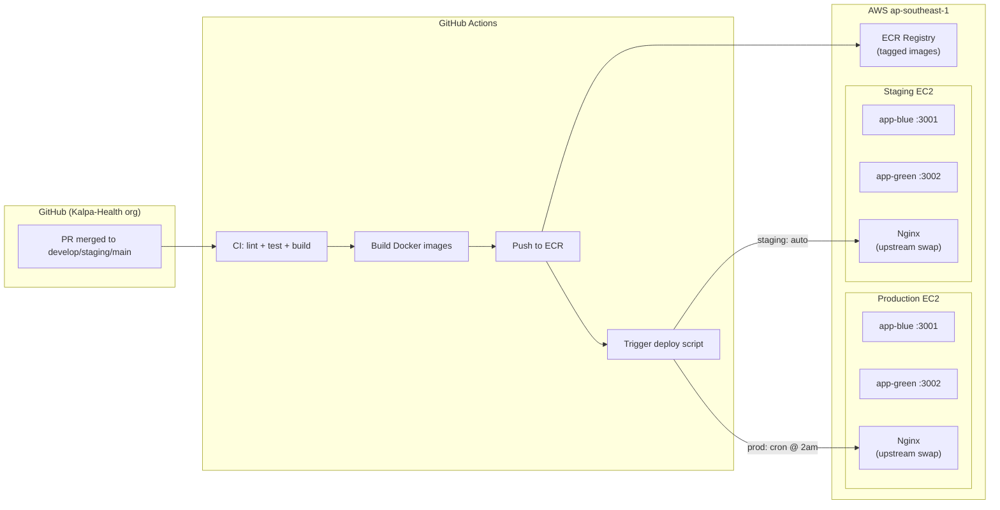
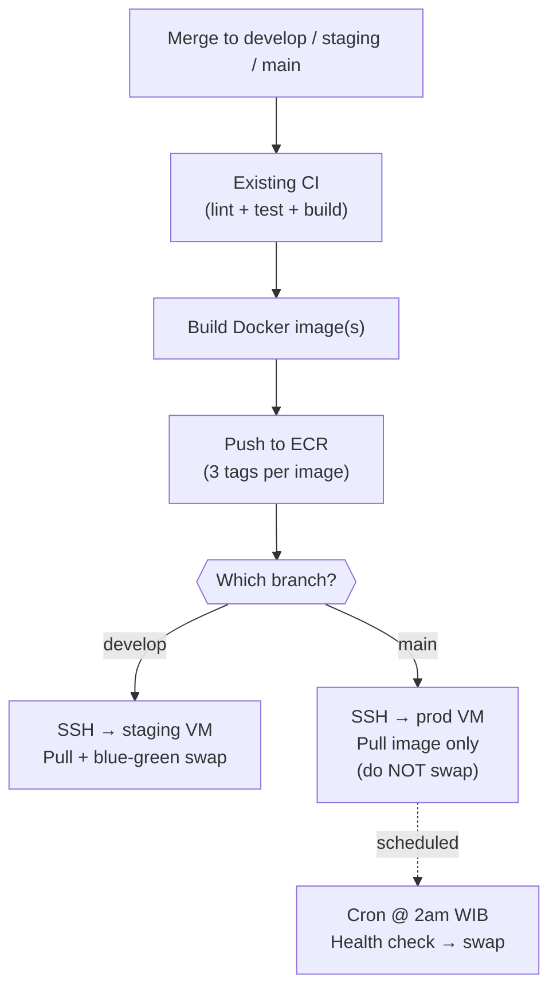
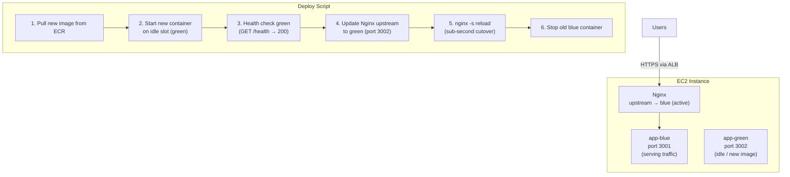
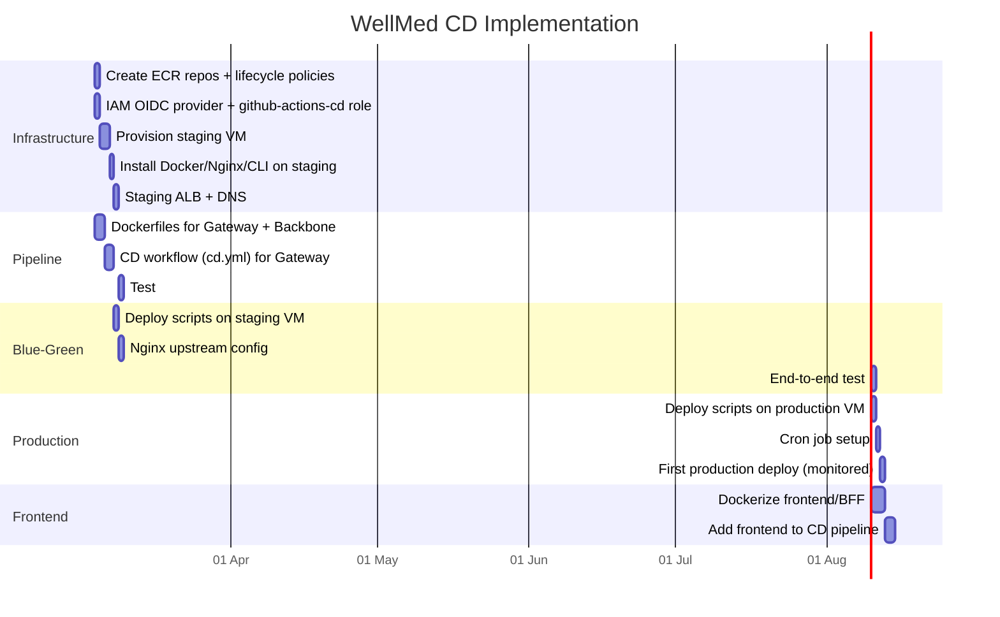

# WellMed CD Plan — Blue-Green Deployment

**Version:** 1.0
**Date:** 03 March 2026
**Status:** Draft — awaiting team review
**Maintained by:** PC, Alex, Hamzah

### Key Changes
- Initial version. Covers ECR setup, GitHub Actions CD pipeline, blue-green deployment on EC2, staging VM provisioning, and rollback procedures.

> **Scope:** WellMed platform only (Gateway, Backbone, Frontend/BFF). Chatwoot-services, broadcast, and router are out of scope for this phase.
> **Prerequisite docs:** [`wellmed-system-architecture.md`](wellmed-system-architecture.md) for architecture context, [`ci-cd-guide.md`](development/ci-cd-guide.md) for existing CI pipeline.

---

# 1. Current State

1.1 CI exists on GitHub Actions: lint, unit tests, build verification, Claude PR review. See `ci-cd-guide.md v0.2` for workflow details.

1.2 CD does not exist. Deployments are manual — SSH into VM, pull code, build, restart. This creates coupling between "code is ready" and "we have to take downtime now."

1.3 The WellMed platform runs as multiple containers on EC2: Go microservices (Gateway, Backbone, future services) in Docker, and a Nuxt.js frontend with BFF running under PM2. Database is on a separate EC2 instance.

1.4 Three environments are needed: dev, staging, production. Only production exists today. Staging VM needs provisioning.

---

# 2. Target State



2.1 Every merge to `develop` triggers CI → build → push to ECR → auto-deploy to staging.

2.2 Every merge to `main` (Red-level, CTO only) triggers CI → build → push to ECR → image staged on production. A cron job at 2:00 AM WIB performs the blue-green cutover. No PR approval triggers downtime.

2.3 Blue-green swap is handled by Nginx upstream reconfiguration — sub-second cutover, zero dropped requests. Both containers run simultaneously; only one receives traffic.

2.4 Rollback is one command: swap Nginx back to the previous container.

---

# 3. ECR Setup

## 3.1 Repository Structure

3.1.1 One ECR repository per deployable image. For the current WellMed architecture, that's three repos:

| ECR Repository | Contents | Source Repo |
|----------------|----------|-------------|
| `kalpa/gateway` | Gateway service (Go binary in Alpine) | `kalpa-gateway` |
| `kalpa/backbone` | Backbone service (Go binary in Alpine) | `kalpa-backbone` |
| `kalpa/frontend` | Nuxt.js app + BFF (Node.js runtime) | `kalpa-frontend` |

3.1.2 As new services are split out of Backbone (EMR, Cashier, etc.), each gets its own ECR repo following the pattern `kalpa/{service-name}`.

## 3.2 Image Tagging Strategy

3.2.1 Every image gets three tags on push:

| Tag | Format | Example | Purpose |
|-----|--------|---------|---------|
| Git SHA | `sha-{short_hash}` | `sha-a1b2c3d` | Immutable, traceable to exact commit |
| Branch | `{branch_name}` | `develop`, `main` | Mutable, always points to latest for that branch |
| Timestamp | `{branch}-{YYYYMMDD-HHMMSS}` | `main-20260303-140000` | Human-readable, sortable |

3.2.2 The `main` tag always points to the latest production-ready image. The `develop` tag always points to the latest staging image. The SHA tag is the immutable reference used for rollbacks.

## 3.3 ECR Lifecycle Policy

3.3.1 Retain the last 20 tagged images per repository. Untagged images expire after 7 days. This keeps costs minimal (~$0.10/GB/month for stored images) while preserving enough history for rollbacks.

## 3.4 Provisioning

  [ ] 3.4.1 Create ECR repositories — @Hamzah
  ```bash
  aws ecr create-repository --repository-name kalpa/gateway --region ap-southeast-1
  aws ecr create-repository --repository-name kalpa/backbone --region ap-southeast-1
  aws ecr create-repository --repository-name kalpa/frontend --region ap-southeast-1
  ```

  [ ] 3.4.2 Apply lifecycle policy to each repo — @Hamzah
  ```json
  {
    "rules": [
      {
        "rulePriority": 1,
        "description": "Expire untagged after 7 days",
        "selection": { "tagStatus": "untagged", "countType": "sinceImagePushed", "countUnit": "days", "countNumber": 7 },
        "action": { "type": "expire" }
      },
      {
        "rulePriority": 2,
        "description": "Keep last 20 tagged images",
        "selection": { "tagStatus": "tagged", "tagPrefixList": ["sha-", "main", "develop"], "countType": "imageCountMoreThan", "countNumber": 20 },
        "action": { "type": "expire" }
      }
    ]
  }
  ```

  [ ] 3.4.3 Create IAM policy for GitHub Actions to push to ECR — @Hamzah (see Section 4.2)

---

# 4. GitHub Actions CD Pipeline

## 4.1 Workflow Overview

4.1.1 The CD workflow extends the existing CI pipeline. It runs after CI passes and only on merges to `develop`, `staging`, or `main` (not on PRs).



## 4.2 AWS Credentials for GitHub Actions

4.2.1 Use OIDC federation (not static keys). GitHub Actions authenticates to AWS via a short-lived token — no long-lived secrets to rotate.

  [ ] 4.2.1.1 Create IAM OIDC identity provider for GitHub Actions — @Hamzah
  ```bash
  aws iam create-open-id-connect-provider \
    --url https://token.actions.githubusercontent.com \
    --client-id-list sts.amazonaws.com \
    --thumbprint-list 6938fd4d98bab03faadb97b34396831e3780aea1
  ```

  [ ] 4.2.1.2 Create IAM role `github-actions-cd` with trust policy scoped to the Kalpa-Health org — @Hamzah
  ```json
  {
    "Version": "2012-10-17",
    "Statement": [{
      "Effect": "Allow",
      "Principal": { "Federated": "arn:aws:iam::{ACCOUNT_ID}:oidc-provider/token.actions.githubusercontent.com" },
      "Action": "sts:AssumeRoleWithWebIdentity",
      "Condition": {
        "StringEquals": { "token.actions.githubusercontent.com:aud": "sts.amazonaws.com" },
        "StringLike": { "token.actions.githubusercontent.com:sub": "repo:Kalpa-Health/*:ref:refs/heads/*" }
      }
    }]
  }
  ```

  [ ] 4.2.1.3 Attach policy granting ECR push + SSM read + EC2 describe — @Hamzah
  ```json
  {
    "Version": "2012-10-17",
    "Statement": [
      {
        "Effect": "Allow",
        "Action": ["ecr:GetAuthorizationToken", "ecr:BatchCheckLayerAvailability", "ecr:PutImage", "ecr:InitiateLayerUpload", "ecr:UploadLayerPart", "ecr:CompleteLayerUpload", "ecr:BatchGetImage", "ecr:GetDownloadUrlForLayer"],
        "Resource": "arn:aws:ecr:ap-southeast-1:{ACCOUNT_ID}:repository/kalpa/*"
      },
      {
        "Effect": "Allow",
        "Action": "ecr:GetAuthorizationToken",
        "Resource": "*"
      },
      {
        "Effect": "Allow",
        "Action": ["ssm:GetParameter", "ssm:GetParametersByPath"],
        "Resource": "arn:aws:ssm:ap-southeast-1:{ACCOUNT_ID}:parameter/wellmed/*"
      }
    ]
  }
  ```

  [ ] 4.2.1.4 Store IAM role ARN as GitHub org secret `AWS_CD_ROLE_ARN` — @Alex

## 4.3 CD Workflow File

4.3.1 This file goes in each service repo at `.github/workflows/cd.yml`. Below is the Gateway version — Backbone and Frontend follow the same pattern with different Dockerfile paths and ECR repo names.

```yaml
name: CD — Build, Push, Deploy

on:
  push:
    branches: [develop, staging, main]

permissions:
  id-token: write   # OIDC
  contents: read

env:
  AWS_REGION: ap-southeast-1
  ECR_REPO: kalpa/gateway   # change per service

jobs:
  ci:
    # reuse existing CI workflow
    uses: ./.github/workflows/ci.yml

  build-and-push:
    needs: ci
    runs-on: ubuntu-latest
    outputs:
      image_tag: ${{ steps.meta.outputs.sha_tag }}
    steps:
      - uses: actions/checkout@v4

      - name: Configure AWS credentials (OIDC)
        uses: aws-actions/configure-aws-credentials@v4
        with:
          role-to-assume: ${{ secrets.AWS_CD_ROLE_ARN }}
          aws-region: ${{ env.AWS_REGION }}

      - name: Login to ECR
        id: ecr-login
        uses: aws-actions/amazon-ecr-login@v2

      - name: Build and tag image
        id: meta
        run: |
          REGISTRY=${{ steps.ecr-login.outputs.registry }}
          SHA_TAG="sha-$(git rev-parse --short HEAD)"
          BRANCH_TAG="${GITHUB_REF_NAME}"
          TS_TAG="${GITHUB_REF_NAME}-$(date +%Y%m%d-%H%M%S)"

          docker build -t $REGISTRY/$ECR_REPO:$SHA_TAG \
                       -t $REGISTRY/$ECR_REPO:$BRANCH_TAG \
                       -t $REGISTRY/$ECR_REPO:$TS_TAG .

          docker push $REGISTRY/$ECR_REPO --all-tags

          echo "sha_tag=$SHA_TAG" >> "$GITHUB_OUTPUT"
          echo "full_image=$REGISTRY/$ECR_REPO:$SHA_TAG" >> "$GITHUB_OUTPUT"

  deploy-staging:
    needs: build-and-push
    if: github.ref == 'refs/heads/develop'
    runs-on: ubuntu-latest
    steps:
      - name: Configure AWS credentials
        uses: aws-actions/configure-aws-credentials@v4
        with:
          role-to-assume: ${{ secrets.AWS_CD_ROLE_ARN }}
          aws-region: ${{ env.AWS_REGION }}

      - name: Deploy to staging (blue-green swap)
        uses: appleboy/ssh-action@v1
        with:
          host: ${{ secrets.STAGING_HOST }}
          username: ${{ secrets.STAGING_USER }}
          key: ${{ secrets.STAGING_SSH_KEY }}
          script: |
            /opt/deploy/blue-green-swap.sh ${{ env.ECR_REPO }} ${{ needs.build-and-push.outputs.image_tag }}

  stage-production:
    needs: build-and-push
    if: github.ref == 'refs/heads/main'
    runs-on: ubuntu-latest
    steps:
      - name: Configure AWS credentials
        uses: aws-actions/configure-aws-credentials@v4
        with:
          role-to-assume: ${{ secrets.AWS_CD_ROLE_ARN }}
          aws-region: ${{ env.AWS_REGION }}

      - name: Pull image to production (no swap)
        uses: appleboy/ssh-action@v1
        with:
          host: ${{ secrets.PROD_HOST }}
          username: ${{ secrets.PROD_USER }}
          key: ${{ secrets.PROD_SSH_KEY }}
          script: |
            /opt/deploy/pull-and-stage.sh ${{ env.ECR_REPO }} ${{ needs.build-and-push.outputs.image_tag }}
```

4.3.2 GitHub secrets required per repo (in addition to existing CI secrets):

| Secret | Purpose |
|--------|---------|
| `AWS_CD_ROLE_ARN` | OIDC role ARN (org-level secret) |
| `STAGING_HOST` | Staging VM IP or hostname |
| `STAGING_USER` | SSH user for staging |
| `STAGING_SSH_KEY` | SSH private key for staging |
| `PROD_HOST` | Production VM IP or hostname |
| `PROD_USER` | SSH user for production |
| `PROD_SSH_KEY` | SSH private key for production |

---

# 5. Blue-Green Deployment on EC2

## 5.1 How It Works



5.1.1 Two instances of each service run on different ports. Only one is "live" (receiving traffic via Nginx). The other is idle or running the previous version.

5.1.2 On deploy: pull new image → start it in the idle slot → health check → swap Nginx → reload → stop old container. Total cutover time is under 1 second. Zero dropped requests.

5.1.3 On rollback: swap Nginx back to the old container (which is still running for 1 hour after cutover). One command, sub-second recovery.

## 5.2 Docker Compose Configuration

5.2.1 Each service gets a `docker-compose.blue-green.yml` on the VM at `/opt/deploy/`:

```yaml
# /opt/deploy/docker-compose.blue-green.yml
# This file is for Go microservices (Gateway, Backbone).
# Frontend/BFF has its own compose file (see Section 5.5).

version: "3.8"

services:
  gateway-blue:
    image: ${ECR_REGISTRY}/kalpa/gateway:${BLUE_TAG:-latest}
    container_name: gateway-blue
    ports:
      - "3001:3000"
    env_file: /opt/deploy/.env.gateway
    restart: unless-stopped
    healthcheck:
      test: ["CMD", "wget", "-qO-", "http://localhost:3000/health"]
      interval: 10s
      timeout: 5s
      retries: 3

  gateway-green:
    image: ${ECR_REGISTRY}/kalpa/gateway:${GREEN_TAG:-latest}
    container_name: gateway-green
    ports:
      - "3002:3000"
    env_file: /opt/deploy/.env.gateway
    restart: unless-stopped
    healthcheck:
      test: ["CMD", "wget", "-qO-", "http://localhost:3000/health"]
      interval: 10s
      timeout: 5s
      retries: 3

  backbone-blue:
    image: ${ECR_REGISTRY}/kalpa/backbone:${BLUE_TAG:-latest}
    container_name: backbone-blue
    ports:
      - "4001:4000"
    env_file: /opt/deploy/.env.backbone
    restart: unless-stopped
    healthcheck:
      test: ["CMD", "wget", "-qO-", "http://localhost:4000/health"]
      interval: 10s
      timeout: 5s
      retries: 3

  backbone-green:
    image: ${ECR_REGISTRY}/kalpa/backbone:${GREEN_TAG:-latest}
    container_name: backbone-green
    ports:
      - "4002:4000"
    env_file: /opt/deploy/.env.backbone
    restart: unless-stopped
    healthcheck:
      test: ["CMD", "wget", "-qO-", "http://localhost:4000/health"]
      interval: 10s
      timeout: 5s
      retries: 3
```

## 5.3 Nginx Configuration

5.3.1 Nginx upstream blocks for each service, with the active slot toggled by the deploy script:

```nginx
# /etc/nginx/conf.d/wellmed-upstream.conf

# Gateway — currently pointing to blue
upstream gateway_backend {
    server 127.0.0.1:3001;  # blue (active)
    # server 127.0.0.1:3002;  # green (standby)
}

# Backbone — currently pointing to blue
upstream backbone_backend {
    server 127.0.0.1:4001;  # blue (active)
    # server 127.0.0.1:4002;  # green (standby)
}

# Frontend/BFF — currently pointing to blue
upstream frontend_backend {
    server 127.0.0.1:8001;  # blue (active)
    # server 127.0.0.1:8002;  # green (standby)
}
```

5.3.2 The deploy script comments/uncomments lines to swap. `nginx -s reload` picks up the change without dropping connections.

## 5.4 Deploy Scripts

5.4.1 **`/opt/deploy/blue-green-swap.sh`** — full deploy with immediate swap (used for staging):

```bash
#!/bin/bash
# Usage: blue-green-swap.sh <ecr_repo> <image_tag>
# Example: blue-green-swap.sh kalpa/gateway sha-a1b2c3d

set -euo pipefail

ECR_REPO="$1"
IMAGE_TAG="$2"
SERVICE_NAME=$(echo "$ECR_REPO" | cut -d'/' -f2)  # e.g., "gateway"
DEPLOY_DIR="/opt/deploy"
NGINX_CONF="/etc/nginx/conf.d/wellmed-upstream.conf"
LOG_FILE="/var/log/deploy/${SERVICE_NAME}-$(date +%Y%m%d-%H%M%S).log"
ECR_REGISTRY=$(aws ecr get-authorization-token --query 'authorizationData[0].proxyEndpoint' --output text | sed 's|https://||')

exec > >(tee -a "$LOG_FILE") 2>&1
echo "=== Deploy $SERVICE_NAME ($IMAGE_TAG) at $(date) ==="

# 1. Authenticate to ECR
aws ecr get-login-password --region ap-southeast-1 | docker login --username AWS --password-stdin "$ECR_REGISTRY"

# 2. Pull new image
FULL_IMAGE="$ECR_REGISTRY/$ECR_REPO:$IMAGE_TAG"
echo "Pulling $FULL_IMAGE..."
docker pull "$FULL_IMAGE"

# 3. Determine which slot is currently active
if grep -q "# .*:${SERVICE_NAME}.*green.*standby" "$NGINX_CONF" 2>/dev/null || \
   grep -qP "server 127.0.0.1:.*1;\s*#.*blue.*active" "$NGINX_CONF" 2>/dev/null; then
    ACTIVE="blue"
    IDLE="green"
else
    ACTIVE="green"
    IDLE="blue"
fi
echo "Active: $ACTIVE | Deploying to: $IDLE"

# 4. Determine ports based on service
case "$SERVICE_NAME" in
    gateway)  IDLE_PORT=$([[ "$IDLE" == "blue" ]] && echo 3001 || echo 3002) ;;
    backbone) IDLE_PORT=$([[ "$IDLE" == "blue" ]] && echo 4001 || echo 4002) ;;
    frontend) IDLE_PORT=$([[ "$IDLE" == "blue" ]] && echo 8001 || echo 8002) ;;
    *) echo "Unknown service: $SERVICE_NAME"; exit 1 ;;
esac

HEALTH_PORT=$IDLE_PORT

# 5. Stop the idle container if running, start with new image
CONTAINER_NAME="${SERVICE_NAME}-${IDLE}"
docker stop "$CONTAINER_NAME" 2>/dev/null || true
docker rm "$CONTAINER_NAME" 2>/dev/null || true

# Update the compose tag and bring up idle slot
export "${IDLE^^}_TAG=$IMAGE_TAG"
cd "$DEPLOY_DIR"
docker compose -f docker-compose.blue-green.yml up -d "$CONTAINER_NAME"

# 6. Health check (wait up to 60s)
echo "Health checking $CONTAINER_NAME on port $HEALTH_PORT..."
for i in $(seq 1 12); do
    if curl -sf "http://127.0.0.1:$HEALTH_PORT/health" > /dev/null 2>&1; then
        echo "Health check passed!"
        break
    fi
    if [ "$i" -eq 12 ]; then
        echo "HEALTH CHECK FAILED after 60s. Aborting deploy."
        docker stop "$CONTAINER_NAME" 2>/dev/null || true
        exit 1
    fi
    sleep 5
done

# 7. Swap Nginx upstream
echo "Swapping Nginx to $IDLE..."
if [ "$IDLE" == "green" ]; then
    # Activate green, deactivate blue
    sed -i "s|server 127.0.0.1:${IDLE_PORT};.*# ${IDLE} (standby)|server 127.0.0.1:${IDLE_PORT};  # ${IDLE} (active)|" "$NGINX_CONF"
    ACTIVE_PORT=$((IDLE_PORT - 1))
    sed -i "s|server 127.0.0.1:${ACTIVE_PORT};.*# ${ACTIVE} (active)|# server 127.0.0.1:${ACTIVE_PORT};  # ${ACTIVE} (standby)|" "$NGINX_CONF"
else
    # Activate blue, deactivate green
    sed -i "s|# server 127.0.0.1:${IDLE_PORT};.*# ${IDLE} (standby)|server 127.0.0.1:${IDLE_PORT};  # ${IDLE} (active)|" "$NGINX_CONF"
    ACTIVE_PORT=$((IDLE_PORT + 1))
    sed -i "s|server 127.0.0.1:${ACTIVE_PORT};.*# ${ACTIVE} (active)|# server 127.0.0.1:${ACTIVE_PORT};  # ${ACTIVE} (standby)|" "$NGINX_CONF"
fi

nginx -s reload
echo "Nginx reloaded. Traffic now on $IDLE."

# 8. Keep old container running for 1 hour (rollback window), then stop
echo "Old container ($ACTIVE) will be stopped in 1 hour."
nohup bash -c "sleep 3600 && docker stop ${SERVICE_NAME}-${ACTIVE} 2>/dev/null" &

echo "=== Deploy complete: $SERVICE_NAME → $IMAGE_TAG ($IDLE) ==="
```

5.4.2 **`/opt/deploy/pull-and-stage.sh`** — pull only, no swap (used for production):

```bash
#!/bin/bash
# Usage: pull-and-stage.sh <ecr_repo> <image_tag>
# Pulls the new image and prepares the idle container. Does NOT swap traffic.
# The cron job (Section 5.6) handles the actual cutover.

set -euo pipefail

ECR_REPO="$1"
IMAGE_TAG="$2"
SERVICE_NAME=$(echo "$ECR_REPO" | cut -d'/' -f2)
LOG_FILE="/var/log/deploy/${SERVICE_NAME}-staged-$(date +%Y%m%d-%H%M%S).log"
ECR_REGISTRY=$(aws ecr get-authorization-token --query 'authorizationData[0].proxyEndpoint' --output text | sed 's|https://||')

exec > >(tee -a "$LOG_FILE") 2>&1
echo "=== Staging $SERVICE_NAME ($IMAGE_TAG) at $(date) ==="

# 1. Authenticate and pull
aws ecr get-login-password --region ap-southeast-1 | docker login --username AWS --password-stdin "$ECR_REGISTRY"
docker pull "$ECR_REGISTRY/$ECR_REPO:$IMAGE_TAG"

# 2. Record the staged tag for the cron job to pick up
echo "$IMAGE_TAG" > "/opt/deploy/staged/${SERVICE_NAME}.tag"

echo "=== Image staged. Cron will deploy at next maintenance window. ==="
```

## 5.5 Frontend/BFF Deployment

5.5.1 The Nuxt.js frontend runs under PM2, not Docker (currently). Two options:

**Option A — Dockerize the frontend (recommended).** Build a Docker image that runs the Nuxt app with PM2 inside the container. This lets it participate in the same blue-green flow as the Go services. The Dockerfile:

```dockerfile
FROM node:20-alpine
RUN npm install -g pm2
WORKDIR /app
COPY package*.json ./
RUN npm ci --production
COPY .output/ .output/
COPY ecosystem.config.js .
EXPOSE 3000
CMD ["pm2-runtime", "ecosystem.config.js"]
```

5.5.2 **Option B — Keep PM2 on host, use directory swap.** If dockerizing is too much change right now, deploy two directories (`/opt/app/frontend-blue` and `/opt/app/frontend-green`), each with its own PM2 process on different ports (8001, 8002). Nginx swaps between them the same way. (This works but adds complexity the team has to maintain separately from the Docker flow.)

5.5.3 Open question for Alex: is there a reason the frontend can't be containerized? The BFF (Nitro) and SSR both run fine in Docker. PM2-runtime inside the container handles process management. If no blockers, go with Option A so everything follows one deployment pattern.

## 5.6 Production Cron Job

5.6.1 The cron job runs nightly and checks if any new images have been staged. If yes, it deploys them using the blue-green swap. If no staged images exist, it does nothing.

```bash
# /etc/cron.d/wellmed-deploy
# Run at 2:00 AM WIB (UTC+7 = 19:00 UTC previous day)
0 19 * * * root /opt/deploy/cron-deploy.sh >> /var/log/deploy/cron.log 2>&1
```

5.6.2 **`/opt/deploy/cron-deploy.sh`**:

```bash
#!/bin/bash
set -euo pipefail

STAGED_DIR="/opt/deploy/staged"
DEPLOYED=0

for tag_file in "$STAGED_DIR"/*.tag; do
    [ -f "$tag_file" ] || continue

    SERVICE_NAME=$(basename "$tag_file" .tag)
    IMAGE_TAG=$(cat "$tag_file")

    echo "=== Cron deploying $SERVICE_NAME → $IMAGE_TAG at $(date) ==="
    /opt/deploy/blue-green-swap.sh "kalpa/$SERVICE_NAME" "$IMAGE_TAG"

    # Remove staged marker after successful deploy
    rm "$tag_file"
    DEPLOYED=$((DEPLOYED + 1))
done

if [ "$DEPLOYED" -eq 0 ]; then
    echo "=== No staged deployments at $(date) ==="
fi
```

5.6.3 If the health check fails during the cron deploy, the swap script exits non-zero and the `.tag` file remains — the team gets alerted (see Section 8) and can investigate in the morning.

---

# 6. Staging VM Provisioning

## 6.1 Spec

| Setting | Value | Rationale |
|---------|-------|-----------|
| Instance type | `t4g.medium` (2 vCPU, 4GB, ARM64) | Matches production class; ARM for cost savings |
| OS | Ubuntu 24.04 LTS | Consistent with Chatwoot staging VM |
| Region | `ap-southeast-1` | Same as production |
| VPC / Subnet | Same VPC as production, separate staging subnet | Network isolation with connectivity |
| Storage | 30GB gp3 root volume | Room for Docker images + build artifacts |
| Security Group | SSH from VPN SG only, ALB inbound on 80/443 | Matches production pattern |
| Elastic IP | Yes | Stable SSH and webhook targets |

## 6.2 Provisioning Tasks

  [ ] 6.2.1 Launch EC2 instance with above spec — @Hamzah
  [ ] 6.2.2 Install Docker, Docker Compose, Nginx, AWS CLI v2 — @Hamzah
  [ ] 6.2.3 Configure ECR authentication (IAM instance role with ECR pull permissions) — @Hamzah
  [ ] 6.2.4 Copy deploy scripts to `/opt/deploy/` — @Alex
  [ ] 6.2.5 Create `/opt/deploy/staged/` directory — @Alex
  [ ] 6.2.6 Set up Nginx with upstream config (Section 5.3) — @Alex
  [ ] 6.2.7 Create ALB target group for staging, attach instance — @Hamzah
  [ ] 6.2.8 DNS: `staging.wellmed.kalpahealth.com` → staging ALB — @Hamzah
  [ ] 6.2.9 Provision staging database (separate EC2, mirroring prod DB pattern) — @Hamzah
  [ ] 6.2.10 Configure `.env` files for staging services with staging DB connection + SSM paths — @Alex

---

# 7. Rollback Procedures

## 7.1 Immediate Rollback (< 1 hour after deploy)

7.1.1 The previous container is still running on the standby port. Swap Nginx back:

```bash
# Example: roll back gateway from green to blue
# Edit /etc/nginx/conf.d/wellmed-upstream.conf
# Re-enable blue, comment out green (reverse of deploy)
sudo nginx -s reload
```

7.1.2 Total recovery time: under 10 seconds.

## 7.2 Delayed Rollback (old container already stopped)

7.2.1 Start the previous image using its SHA tag:

```bash
# Check available images
docker images | grep kalpa/gateway

# Start the previous version on the idle port
docker run -d --name gateway-blue \
  -p 3001:3000 \
  --env-file /opt/deploy/.env.gateway \
  <ECR_REGISTRY>/kalpa/gateway:sha-<previous_sha>

# Health check, then swap Nginx
```

## 7.3 Emergency Rollback (image not on disk)

7.3.1 Pull the last known good image from ECR:

```bash
# List recent tags
aws ecr describe-images --repository-name kalpa/gateway \
  --query 'sort_by(imageDetails,& imagePushedAt)[-5:].imageTags' \
  --output table

# Pull and deploy
docker pull <ECR_REGISTRY>/kalpa/gateway:sha-<known_good_sha>
# Then follow 7.2 steps
```

---

# 8. Monitoring and Alerts

## 8.1 Deploy Notifications

8.1.1 GitHub Actions posts to a `#deployments` channel (Slack or WhatsApp group) on every build+push. Includes: service name, image tag, target environment, and status (success/fail).

8.1.2 The cron deploy script sends a notification on swap completion or failure. On failure (health check didn't pass), the alert includes the service name and log file path.

## 8.2 Health Check Monitoring

8.2.1 After any deploy, CloudWatch monitors the `/health` endpoints at 60s intervals (already defined in system architecture §5.2). If a newly deployed service starts failing health checks, the team gets alerted through existing CloudWatch alarms.

## 8.3 Deploy Logs

8.3.1 All deploy scripts log to `/var/log/deploy/`. Retention: 30 days. These logs include the image tag deployed, health check results, and Nginx swap confirmation — everything needed for post-incident review.

---

# 9. Dockerfiles

## 9.1 Go Services (Gateway, Backbone)

9.1.1 Multi-stage build. Compile on a full Go image, copy the binary to a minimal Alpine image. Keeps final image under 30MB.

```dockerfile
# Build stage
FROM golang:1.22-alpine AS builder
RUN apk add --no-cache git
WORKDIR /app
COPY go.mod go.sum ./
RUN go mod download
COPY . .
RUN CGO_ENABLED=0 GOOS=linux go build -o /app/server ./cmd/server

# Runtime stage
FROM alpine:3.19
RUN apk add --no-cache ca-certificates wget
COPY --from=builder /app/server /usr/local/bin/server
EXPOSE 3000
HEALTHCHECK --interval=10s --timeout=5s CMD wget -qO- http://localhost:3000/health || exit 1
ENTRYPOINT ["server"]
```

9.1.2 Each Go service repo gets this Dockerfile at the repo root. Adjust the build path (`./cmd/server`) and expose port as needed per service.

## 9.2 Frontend/BFF (Nuxt.js)

9.2.1 See Section 5.5.1 for the Dockerfile. Build the Nuxt app in CI (`npm run build`), then copy the `.output/` directory into the Docker image.

---

# 10. Implementation Sequence



10.1 **Phase 1 (Week 1): Infrastructure + Gateway pipeline.** Hamzah sets up ECR, IAM, staging VM. Alex writes Dockerfiles and cd.yml for Gateway. Goal: merge to develop triggers auto-deploy to staging.

10.2 **Phase 2 (Week 2): Blue-green on staging + Backbone.** Deploy scripts and Nginx config on staging. Replicate for Backbone. Full end-to-end test: PR merge → ECR push → staging swap.

10.3 **Phase 3 (Week 2-3): Production.** Copy deploy scripts to production VM. Set up cron job. First production deploy under manual observation (team watches the 2am cutover).

10.4 **Phase 4 (Week 3-4): Frontend.** Dockerize the Nuxt app. Add to CD pipeline. This is the most likely to surface surprises (PM2 behavior in Docker, BFF SSR memory usage), so it gets its own phase.

---

# 11. Open Questions

11.1 **Frontend containerization.** Does Alex see any blockers to running Nuxt/BFF inside Docker with PM2-runtime? The BFF's server-side rendering and proxy behavior need testing in a container context. (See Section 5.5.3.)

11.2 **Staging database seeding.** How will staging DB be populated? Options: anonymized production snapshot, seed scripts, or manual setup. This affects how realistic staging tests are.

11.3 **Multiple services, one VM.** Currently all services run on one EC2. The blue-green compose file handles this, but port management gets complex as services grow. At what service count does the team want to reconsider ECS Fargate? (Suggested threshold: 5+ independently deployed services.)

11.4 **Secret injection.** The `.env` files on the VM currently hold secrets. These should migrate to SSM Parameter Store injection at container startup (pattern already documented in system architecture §8.1.3 and in our previous SSM conversation). Not a blocker for CD, but should be a fast-follow.

11.5 **Merge to `staging` branch.** The pipeline diagram shows develop → staging → main. Should the staging branch trigger a separate staging deployment, or is develop → staging-VM sufficient? If staging branch has a separate purpose (e.g., QA sign-off gate), it needs its own deploy target.

---

# Edit Log

| Version | Date | Author | Changes |
|---------|------|--------|---------|
| 1.0 | 03 Mar 2026 | PC + Claude | Initial version. ECR setup, GitHub Actions CD pipeline, blue-green deployment, staging VM spec, rollback procedures, implementation timeline. |
