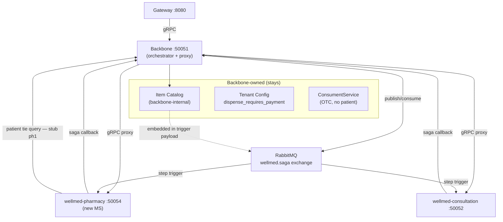
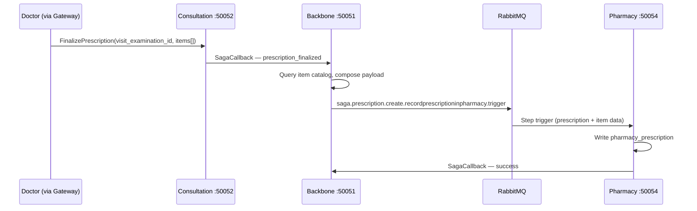
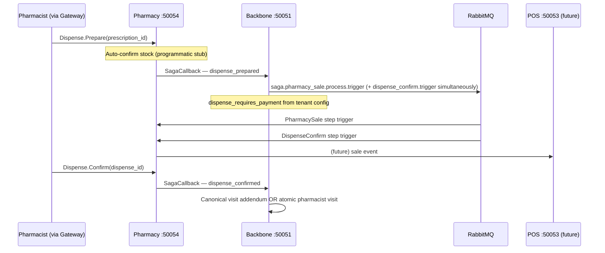

# Pharmacy MS Extraction Plan

**Version:** 1.0
**Date:** 06 March 2026
**Previous Version:** N/A
**Maintained by:** Alex
**Author:** Alex
**Status:** Ready to execute

### Key Changes v1.0
- Initial version

---

## Related Docs

- `kalpa-docs/adrs/ADR-002-consultation-service-extraction.md` — reference pattern
- `kalpa-docs/adrs/ADR-005-saga-orchestration.md` — backbone-only orchestration rules
- `kalpa-docs/adrs/ADR-006-domain-service-boundaries.md` — no direct cross-MS calls
- `kalpa-docs/adrs/ADR-007-per-service-auth-tokens.md` — per-service key pattern
- `kalpa-docs/adrs/ADR-009-canonical-archive-pattern.md` — canonical visit + dispense addendum rules
- `kalpa-docs/services/consultation.md` — reference implementation
- `kalpa-docs/services/backbone.md` — proxy pattern, item catalog, tenant config

---

## 1. Overview

### 1.1 Objective

Extract `wellmed-pharmacy` as a standalone microservice following the consultation extraction pattern (ADR-002). Pharmacy becomes a **saga participant** — backbone orchestrates all multi-step flows. The gateway continues to call backbone only; backbone proxies pharmacy-bound gRPC calls to the new MS.

Phase 1 scope: scaffold, stub all service interfaces, wire saga consumers, update backbone. No inventory management. No real business logic in dispense or sale — those are stubs.

### 1.2 Architecture



### 1.3 Port Assignment

1.3.1 `wellmed-backbone` — `:50051` (existing)
1.3.2 `wellmed-consultation` — `:50052` (existing)
1.3.3 POS MS — `:50053` (future plan, out of scope here)
1.3.4 `wellmed-pharmacy` — `:50054` (this plan)

### 1.4 Key Architectural Decisions

1.4.1 **Saga participation only.** Pharmacy never initiates a saga. Backbone orchestrates all multi-step flows. Pharmacy receives RabbitMQ step triggers and responds via gRPC callback to backbone's `SagaCallbackService`.

1.4.2 **Gateway unchanged.** Gateway calls backbone. Backbone proxies pharmacy gRPC calls to pharmacy MS. No gateway routing changes in this plan.

1.4.3 **Item catalog data in trigger payload.** Backbone queries the item catalog when composing a prescription saga step and embeds item data in the payload. Pharmacy never calls backbone's `ItemService` directly (ADR-006).

1.4.4 **`medication_request` proto in backbone.** `medication_request.proto` is defined in backbone (single source of truth for the interface contract). Both consultation and pharmacy implement parallel Go domain logic against that shared contract. No shared Go library — the proto IS the shared package.

1.4.5 **Dispense-transaction ordering is tenant config.** The boolean `dispense_requires_payment` lives in backbone's tenant config table and arrives embedded in the `PharmacySale` saga trigger payload. Pharmacy reads it from the payload; it does not query backbone at runtime.

1.4.6 **Consument-patient tie.** For OTC flows where a patient is subsequently identified, pharmacy calls backbone gRPC to query/assign the patient tie. This is an ADR-006 exception (same as `CanonicalVisitClient` in consultation). Stubbed in Phase 1.

1.4.7 **Atomic pharmacist visit.** When a patient is confirmed and no open visit/saga exists, pharmacy triggers a new `AtomicPharmacistVisit` saga. Backbone creates and immediately signs off the canonical visit with role `PHARMACIST`. Saga step always succeeds (no incomplete state possible). Stubbed in Phase 1.

1.4.8 **Dispense feeds canonical visit.** If an open visit saga exists when dispense is confirmed, pharmacy sends a saga callback that adds dispensed medications to that canonical visit record. If no open visit, the atomic pharmacist visit path (1.4.7) applies.

1.4.9 **Auth.** `BACKBONE_SERVICE_KEY` shared pattern for now. Per-service key migration (ADR-007 full implementation) is a separate workstream.

1.4.10 **Module path.** `github.com/kalpa-health/wellmed-pharmacy` (fully lowercase per ADR + CLAUDE.md convention).

### 1.5 Prescription Finalize Flow



### 1.6 Dispense → Sale Flow



---

## 2. Phase 0 — Validate & Prep

**Objective:** Confirm baseline state, create repo, bootstrap CI.

2.0.1 Acceptance criteria: Repo exists on GitHub with CI passing on main; all validation findings documented.

  [ ] 2.0.1 Confirm no `PrescriptionService` or `FinalizePrescription` in `wellmed-consultation` — **already validated: absent. Add in Phase 8.** @Alex
  [ ] 2.0.2 Confirm no `pharmacy_sale` saga builder in backbone (`internal/domain/pharmacy_sale/`) — **already validated: directory absent. Create in Phase 7.** @Alex
  [ ] 2.0.3 Create GitHub repo `kalpa-health/wellmed-pharmacy` (empty, `main` branch initialised with a README) @Alex
  [ ] 2.0.4 Run bootstrap script from `wellmed-infrastructure`:
  ```bash
  ./scripts/bootstrap-repo.sh kalpa-health/wellmed-pharmacy \
    --go-version 1.25.6 \
    --binary-name pharmacy \
    --cmd-path ./cmd
  ```
  @Alex
  [ ] 2.0.5 Verify CI workflows (`ci.yml`, `main-approval-check.yml`, `pr-review.yml`) present on `main`, `develop`, `staging` branches @Alex
  [ ] 2.0.6 Clone repo locally to `~/Projects/WellMed/wellmed-pharmacy` @Alex

---

## 3. Phase 1 — Proto Definitions (Backbone)

**Objective:** Define all new gRPC service contracts in backbone's proto directory. Compile to `pb/` packages. These are the source-of-truth interfaces used by pharmacy MS, consultation, and backbone proxy.

3.0.1 Acceptance criteria: `go build ./...` passes in backbone after all protos compiled; no changes to existing proto files.

  [ ] 3.1.1 Create `proto/prescription.proto` — pharmacy-facing prescription service:
  ```protobuf
  service PrescriptionService {
    rpc Index(ListRequest) returns (ListResponse);
    rpc Show(PrescriptionIdRequest) returns (ShowResponse);
    rpc Create(PrescriptionRequest) returns (ShowResponse);
    rpc Update(PrescriptionRequest) returns (ShowResponse);
    rpc Finalize(PrescriptionFinalizeRequest) returns (ShowResponse);
  }
  ```
  @Alex

  [ ] 3.1.2 Create `proto/medication_request.proto` — shared contract (used by both consultation and pharmacy):
  ```protobuf
  service MedicationRequestService {
    rpc Index(ListRequest) returns (ListResponse);
    rpc Show(MedicationRequestIdRequest) returns (ShowResponse);
    rpc Create(MedicationRequestRequest) returns (ShowResponse);
    rpc Approve(MedicationRequestIdRequest) returns (ShowResponse);
    rpc Reject(MedicationRequestIdRequest) returns (ShowResponse);
  }
  // MedicationRequestRequest.payload includes: direction (CONSULTATION_TO_PHARMACY | PHARMACY_TO_CONSULTATION),
  // status (PENDING | APPROVED | REJECTED | SUPERSEDED), source_service, reference_id, items[]
  ```
  @Alex

  [ ] 3.1.3 Create `proto/dispense.proto`:
  ```protobuf
  service DispenseService {
    rpc Index(ListRequest) returns (ListResponse);
    rpc Show(DispenseIdRequest) returns (ShowResponse);
    rpc Prepare(DispenseRequest) returns (ShowResponse);   // stock ack → triggers saga
    rpc Confirm(DispenseIdRequest) returns (ShowResponse); // physical dispense confirmed
  }
  ```
  @Alex

  [ ] 3.1.4 Update `proto/pharmacy_sale.proto` — add `ProcessSale` rpc for saga participant role (keep existing `Index`, `Show`, `Store`) @Alex

  [ ] 3.1.5 Compile all new protos to their `pb/` directories:
  ```bash
  protoc --go_out=. --go-grpc_out=. proto/prescription.proto
  protoc --go_out=. --go-grpc_out=. proto/medication_request.proto
  protoc --go_out=. --go-grpc_out=. proto/dispense.proto
  protoc --go_out=. --go-grpc_out=. proto/pharmacy_sale.proto
  ```
  @Alex

  [ ] 3.1.6 Run `go build ./...` in backbone — must pass @Alex

---

## 4. Phase 2 — wellmed-pharmacy Scaffold

**Objective:** Stand up the service skeleton mirroring the consultation structure. Service starts, connects to DB and Redis, gRPC server accepts connections, RabbitMQ consumer initialises (no handlers yet).

4.0.1 Acceptance criteria: `go build ./...` passes; service starts without panic on `go run ./cmd`; gRPC server listens on `:50054`.

  [ ] 4.1.1 Initialise Go module: `go mod init github.com/kalpa-health/wellmed-pharmacy` @Alex

  [ ] 4.1.2 Create `cmd/main.go` — entry point with graceful shutdown (mirror `wellmed-consultation/cmd/main.go`) @Alex

  [ ] 4.1.3 Create `internal/config/env.go` — load all env vars via `godotenv`:

  | Variable | Required | Purpose |
  |---|---|---|
  | `DB_HOST`, `DB_PORT`, `DB_USERNAME`, `DB_PASSWORD` | ✅ | PostgreSQL |
  | `DB_MAIN` | ✅ | Master DB name |
  | `DB_NAMES`, `DB_SCHEMAS` | ✅ | Tenant DBs and schemas |
  | `JWT_SECRET_KEY` | ✅ | JWT validation |
  | `REDIS_ADDRESS` | ✅ | Redis for JWT session |
  | `BACKBONE_SERVICE_KEY` | ✅ | Service-to-service auth |
  | `CHIPPER` | ✅ | AES-256 for props encryption |
  | `RABBITMQ_URL` | Phase 1 | Saga consumer |
  | `RABBITMQ_EXCHANGE` | Phase 1 | `wellmed.saga` |
  | `RABBITMQ_QUEUE` | Phase 1 | `pharmacy.steps` |
  | `BACKBONE_GRPC_ADDRESS` | Phase 1 | Backbone gRPC endpoint |
  | `APP_ENV` | — | `staging` or `production` |

  [ ] 4.1.4 Copy `internal/db/config/` from consultation — `ConnectionManager`, `TransactionManager`, `TxSet` (multi-tenant pooling pattern, no changes needed) @Alex

  [ ] 4.1.5 Copy `internal/middleware/` from consultation — `jwt_service.go`, `grpc_interceptor.go`, `error_interceptor.go`, `recovery_interceptor.go` @Alex

  [ ] 4.1.6 Copy `internal/tenant/tenant_resolver.go` from consultation @Alex

  [ ] 4.1.7 Create `internal/queue/consumer.go` — `StepConsumer` struct, `RegisterHandler`, `Start` (copy from consultation, update queue name to `pharmacy.steps`) @Alex

  [ ] 4.1.8 Create `internal/clients/saga_callback_client.go` — real gRPC client to backbone (`BACKBONE_GRPC_ADDRESS`) using `sagacallbackpb/` proto (copy from consultation) @Alex

  [ ] 4.1.9 Create `internal/clients/consument_patient_client.go` — **stub** gRPC client to backbone for patient tie query; returns `nil, nil` with a `TODO` comment @Alex

  [ ] 4.1.10 Create `internal/app/application.go` — wire DB, Redis, RabbitMQ, gRPC server, middleware, register all domain servers (empty registrations for now) @Alex

  [ ] 4.1.11 Create `env.example` with all variables from 4.1.3 @Alex

  [ ] 4.1.12 Create `.claude/CLAUDE.md` — service context doc (port, module path, ADR refs, what belongs here vs backbone) @Alex

  [ ] 4.1.13 Run `go build ./...` — must pass @Alex

---

## 5. Phase 3 — DB Entities & Migrations

**Objective:** Define pharmacy-owned database entities. These are the tables pharmacy writes. All use the existing `reference_id` / `reference_type` GORM pattern for cross-service linkage.

5.0.1 Acceptance criteria: All entities compile; migration SQL files are valid; no GORM auto-migrate calls (manual migrations only per project convention).

  [ ] 5.1.1 Create `internal/schema/entity/pharmacy/prescription.go`:
  ```go
  type PharmacyPrescription struct {
      ID                  string         // ULID
      ReferenceID         string         // consultation's prescription ID
      ReferenceType       string         // "Prescription"
      VisitExaminationID  *string
      VisitRegistrationID *string
      PatientID           *string
      Status              string         // PENDING | REVIEWING | APPROVED | PARTIALLY_DISPENSED | FULLY_DISPENSED | CANCELLED
      FinalizedAt         *time.Time
      Props               datatypes.JSON // item catalog snapshot embedded at trigger time
      CreatedAt, UpdatedAt, DeletedAt
  }
  ```
  @Alex

  [ ] 5.1.2 Create `internal/schema/entity/pharmacy/medication_request.go`:
  ```go
  type PharmacyMedicationRequest struct {
      ID            string         // ULID
      Direction     string         // CONSULTATION_TO_PHARMACY | PHARMACY_TO_CONSULTATION
      Status        string         // PENDING | APPROVED | REJECTED | SUPERSEDED
      SourceService string         // "consultation" | "pharmacy"
      ReferenceID   string         // source prescription or dispense ID
      ReferenceType string
      Items         datatypes.JSON // []MedicationRequestItem
      ApprovedBy    *string
      ApprovedAt    *time.Time
      Notes         string
      Props         datatypes.JSON
      CreatedAt, UpdatedAt, DeletedAt
  }
  ```
  @Alex

  [ ] 5.1.3 Create `internal/schema/entity/pharmacy/dispense.go`:
  ```go
  type PharmacyDispense struct {
      ID                      string         // ULID
      PharmacyPrescriptionID  string
      Status                  string         // PENDING | PREPARED | DISPENSED | CANCELLED
      PreparedAt              *time.Time
      DispensedAt             *time.Time
      DispensedBy             *string        // pharmacist employee ID
      Props                   datatypes.JSON
      CreatedAt, UpdatedAt, DeletedAt
  }
  ```
  @Alex

  [ ] 5.1.4 Create `internal/schema/entity/pharmacy/sale.go` — extract from backbone's `PharmacySale` entity (add `PharmacyPrescriptionID`, `PharmacyDispenseID` foreign keys) @Alex

  [ ] 5.1.5 Create `internal/db/migration/sql/001_pharmacy_tables.sql` — `CREATE TABLE` statements for all four entities @Alex

  [ ] 5.1.6 Run `go build ./...` — must pass @Alex

---

## 6. Phase 4 — Domain Layer Stubs

**Objective:** Create the service and repository interfaces for all four domains. Implementations return `codes.Unimplemented` or typed stub responses — no real DB queries yet (except `FindById`/`FindAll` which can be wired).

6.0.1 Acceptance criteria: All interfaces defined; `wires.go` for each domain compiles; `go build ./...` passes.

  [ ] 6.1.1 Create `internal/domain/prescription/` with `service/prescription.go`, `repository/prescription.go`, `wires.go` — interface methods: `GetAll`, `GetById`, `Create`, `Update`, `Finalize` @Alex

  [ ] 6.1.2 Create `internal/domain/medication_request/` with `service/medication_request.go`, `repository/medication_request.go`, `wires.go` — interface methods: `GetAll`, `GetById`, `Create`, `Approve`, `Reject` @Alex

  [ ] 6.1.3 Create `internal/domain/dispense/` with `service/dispense.go`, `repository/dispense.go`, `wires.go` — interface methods: `GetAll`, `GetById`, `Prepare`, `Confirm` @Alex

  [ ] 6.1.4 Create `internal/domain/pharmacy_sale/` with `service/pharmacy_sale.go`, `repository/pharmacy_sale.go`, `wires.go` — interface methods: `GetAll`, `GetById`, `Store`, `ProcessSale` @Alex

  [ ] 6.1.5 Register all four modules in `internal/app/application.go` @Alex

  [ ] 6.1.6 Run `go build ./...` — must pass @Alex

---

## 7. Phase 5 — gRPC Server Stubs

**Objective:** Thin gRPC handler wrappers for each domain. All write methods return `codes.Unimplemented` with a clear `TODO` comment. Read methods (`Index`, `Show`) are wired to the domain service.

7.0.1 Acceptance criteria: All four servers registered with the gRPC server; `grpcurl` can list services against `:50054`; read stubs return empty responses without panic.

  [ ] 7.1.1 Create `internal/grpc/server/prescription.go` — `PrescriptionServer` embedding `UnimplementedPrescriptionServiceServer` @Alex

  [ ] 7.1.2 Create `internal/grpc/server/medication_request.go` — `MedicationRequestServer` @Alex

  [ ] 7.1.3 Create `internal/grpc/server/dispense.go` — `DispenseServer` @Alex

  [ ] 7.1.4 Create `internal/grpc/server/pharmacy_sale.go` — `PharmacySaleServer` @Alex

  [ ] 7.1.5 Register all servers in `application.go`:
  ```go
  prescriptionpb.RegisterPrescriptionServiceServer(grpcServer, grpcserver.NewPrescriptionServer(...))
  medicationrequestpb.RegisterMedicationRequestServiceServer(grpcServer, grpcserver.NewMedicationRequestServer(...))
  dispensepb.RegisterDispenseServiceServer(grpcServer, grpcserver.NewDispenseServer(...))
  pharmacysalepb.RegisterPharmacySaleServiceServer(grpcServer, grpcserver.NewPharmacySaleServer(...))
  ```
  @Alex

  [ ] 7.1.6 Enable gRPC reflection (same as consultation) @Alex

  [ ] 7.1.7 Run `go build ./...` — must pass @Alex

---

## 8. Phase 6 — Saga Step Handlers

**Objective:** Register pharmacy as a saga participant. Three step handlers: one for prescription creation, one for pharmacy sale processing, one for the atomic pharmacist visit (stub — always succeeds).

8.0.1 Acceptance criteria: Handlers registered and consuming from `pharmacy.steps` queue; `CreatePrescriptionHandler` writes a `PharmacyPrescription` record when triggered; other handlers log receipt and return success.

  [ ] 8.1.1 Create `internal/queue/steps/create_prescription_handler.go`:
  - Routing keys: `saga.prescription.create.recordprescriptioninpharmacy.trigger` and `.compensate`
  - Trigger: unmarshal payload → upsert `PharmacyPrescription` (ULID, status `PENDING`) → call `SagaCallbackClient.Success`
  - Compensate: set status `CANCELLED` → callback success
  @Alex

  [ ] 8.1.2 Create `internal/queue/steps/pharmacy_sale_handler.go`:
  - Routing keys: `saga.pharmacy_sale.process.trigger` and `.compensate`
  - Trigger: log receipt, read `dispense_requires_payment` from payload props, stub → callback success
  - Compensate: stub → callback success
  - Comment: full POS integration is a follow-up plan
  @Alex

  [ ] 8.1.3 Create `internal/queue/steps/atomic_pharmacist_visit_handler.go`:
  - Routing keys: `saga.pharmacist_visit.atomic.create.trigger` and `.compensate`
  - Both trigger and compensate: log receipt → callback success (no failure path per ADR-010 decision)
  @Alex

  [ ] 8.1.4 Register all three handlers in `application.go`'s `StepConsumer` @Alex

  [ ] 8.1.5 Run `go build ./...` — must pass @Alex

---

## 9. Phase 7 — Backbone Wiring

**Objective:** Backbone gains a pharmacy gRPC client, proxies existing `PharmacyService`/`PharmacySaleService` to the new MS, gains a new prescription saga step, atomic pharmacist visit saga type, and tenant config flag.

9.0.1 Acceptance criteria: `go build ./...` passes in backbone; backbone can route a `PharmacyService.Index` call to pharmacy MS; prescription saga step publishes to RabbitMQ with item catalog data embedded.

  [ ] 9.1.1 Add `PHARMACY_GRPC_ADDRESS` env var to `internal/config/env.go` @Alex

  [ ] 9.1.2 Add `BACKBONE_API_KEY_PHARMACY` to `internal/config/env.go` and to the service key auth map (ADR-007 pattern) @Alex

  [ ] 9.1.3 Create `internal/grpc/client/pharmacy_client.go` — gRPC client to `PHARMACY_GRPC_ADDRESS` (mirror `consultation_grpc_client.go` pattern) @Alex

  [ ] 9.1.4 Update backbone's `PharmacyService` gRPC handler — route all calls through `pharmacy_client.go` (proxy pattern):
  - `Index` → `pharmacy_client.Index`
  - `Show` → `pharmacy_client.Show`
  - `Store` → log deprecation warning + proxy (store will become `Create` in pharmacy; keep old route working during migration)
  @Alex

  [ ] 9.1.5 Update backbone's `PharmacySaleService` gRPC handler — proxy all calls to pharmacy MS via `pharmacy_client.PharmacySale*` @Alex

  [ ] 9.1.6 Add `RecordPrescriptionInPharmacy` saga step to the prescription finalize flow:
  - Step name: `recordprescriptioninpharmacy`
  - Saga: new or attach to existing frontline saga builder
  - Payload composition: backbone queries item catalog for all `reference_id`s in the prescription array, embeds item data in `Props`
  - RabbitMQ routing key: `saga.prescription.create.recordprescriptioninpharmacy.{trigger|compensate}`
  @Alex

  [ ] 9.1.7 Create `internal/domain/pharmacy_sale/saga/builder.go` — `PharmacySale` saga builder:
  - Steps: `processpharmacysale` (pharmacy MS), `processsaletransaction` (stub — future POS)
  - Configurable step ordering based on `dispense_requires_payment` from tenant config
  @Alex

  [ ] 9.1.8 Create `internal/domain/pharmacist_visit/saga/builder.go` — `AtomicPharmacistVisit` saga builder:
  - Steps: `createatomicpharmacistvisit`
  - On trigger: backbone writes canonical visit with `signed_off_by_role: PHARMACIST`, `signed_off_at: now`
  - No failure/compensate path (ADR-010: this visit cannot be incomplete)
  @Alex

  [ ] 9.1.9 Add `dispense_requires_payment bool` to backbone's tenant config entity and migration @Alex

  [ ] 9.1.10 Update `SagaContinuator` to recognise new saga types: `pharmacy_sale`, `pharmacist_visit` @Alex

  [ ] 9.1.11 Add `BACKBONE_API_KEY_PHARMACY` to `wellmed-infrastructure/ssm/parameters/backbone.json` @Alex

  [ ] 9.1.12 Run `go build ./...` in backbone — must pass @Alex

---

## 10. Phase 8 — wellmed-consultation Additions

**Objective:** Add `PrescriptionService` and `FinalizePrescription` to consultation. Add `MedicationRequestService` domain (same structure as pharmacy's). These mirror pharmacy's interfaces exactly — same proto contract, parallel implementation.

10.0.1 Acceptance criteria: `go build ./...` passes in consultation; `FinalizePrescription` gRPC method exists and calls `SagaCallbackClient` with a `prescription_finalized` event; `MedicationRequestService` registered on gRPC server.

  [ ] 10.1.1 Copy `prescriptionpb/` compiled proto from backbone to consultation's `proto/` directory @Alex

  [ ] 10.1.2 Copy `medicationrequestpb/` compiled proto from backbone to consultation's `proto/` directory @Alex

  [ ] 10.1.3 Create `internal/domain/prescription/` in consultation — `service/prescription.go`, `repository/prescription.go`, `wires.go`:
  - `GetAll`, `GetById`, `Create`, `Update` — wired (thin wrappers on existing assessment/prescription data)
  - `Finalize(visitExaminationID string, items []PrescriptionItem)` — writes prescription records, then calls `SagaCallbackClient` with event `prescription_finalized`
  @Alex

  [ ] 10.1.4 Create `internal/domain/medication_request/` in consultation — same structure and interface as pharmacy's `medication_request` domain (direction `CONSULTATION_TO_PHARMACY` for doctor-initiated; `PHARMACY_TO_CONSULTATION` for stub incoming) @Alex

  [ ] 10.1.5 Create `internal/grpc/server/prescription.go` in consultation — `PrescriptionServer` with all five methods; `Finalize` is the only non-stub @Alex

  [ ] 10.1.6 Create `internal/grpc/server/medication_request.go` in consultation — `MedicationRequestServer`, all methods stub except `Create` @Alex

  [ ] 10.1.7 Update `proto/frontlinepb/` — add `FinalizePrescription` rpc to `FrontlineService` proto in backbone; recompile; copy to consultation @Alex

  [ ] 10.1.8 Register both new servers in consultation's `application.go` @Alex

  [ ] 10.1.9 Run `go build ./...` in consultation — must pass @Alex

---

## 11. Phase 9 — Infrastructure & Documentation

**Objective:** SSM manifest for pharmacy, service doc, ADR committed, MEMORY.md updated.

11.0.1 Acceptance criteria: All docs committed; `wellmed-infrastructure` has pharmacy SSM manifest; MEMORY.md reflects new MS.

  [ ] 11.1.1 Create `wellmed-infrastructure/ssm/parameters/pharmacy.json` — list all env vars from Phase 2 (4.1.3) with placeholder values @Alex

  [ ] 11.1.2 Commit ADR-010 drafted in Phase 0 (2.0.3) — ensure it references all 1.4.x decisions above @Alex

  [ ] 11.1.3 Create `kalpa-docs/services/pharmacy.md` — service context doc (port, module path, domain ownership, what's stubbed vs live, saga participant routing keys) @Alex

  [ ] 11.1.4 Update `kalpa-docs/services/backbone.md` — add pharmacy proxy pattern, `PHARMACY_GRPC_ADDRESS`, new saga types @Alex

  [ ] 11.1.5 Update `kalpa-docs/services/consultation.md` — add `PrescriptionService`, `MedicationRequestService`, `FinalizePrescription` @Alex

  [ ] 11.1.6 Update `wellmed-infrastructure/.claude/CLAUDE.md` — add pharmacy SSM manifest to key files list @Alex

  [ ] 11.1.7 Update MEMORY.md — add pharmacy MS entry (port, module, status, saga routing keys) @Alex

  [ ] 11.1.8 Update this plan's **Status** to `Complete` and move to `kalpa-docs/plans/archive/` @Alex

---

## 12. Open Questions

12.1 **Canonical visit schema for pharmacist sign-off.** ADR-009 currently assumes `signed_off_by` is a doctor/practitioner. The atomic pharmacist visit requires `signed_off_by_role: PHARMACIST`. Open question: does this need an ADR-009 amendment, or is it handled by a `Props` field on the canonical visit? Resolve before Phase 7.8 executes. @Alex

12.2 **`FinalizePrescription` gRPC placement.** Currently assigned to a new `PrescriptionService`. Confirm whether the doctor triggers this via the gateway calling backbone → consultation, or whether a new proto rpc on `FrontlineService` is cleaner given the doctor's UX context. Resolve before Phase 8.7 executes. @Alex

12.3 **Dispense feeds canonical visit — callback shape.** When dispense is confirmed and an open visit saga exists, pharmacy calls backbone's `SagaCallbackService`. Backbone needs to know to update the canonical visit. Does this require a new saga step type, or can it use the existing callback with a structured `Props` payload? Resolve before Phase 6 executes. @Alex

---

# Edit Log

| Version | Date | Author | Changes |
|---------|------|--------|---------|
| 1.0 | 06 March 2026 | Alex | Initial version — full pharmacy extraction plan covering 9 phases, 4 new domains, backbone proxy wiring, consultation additions, and saga participant pattern. Status: Draft pending ADR-010 authoring. |
