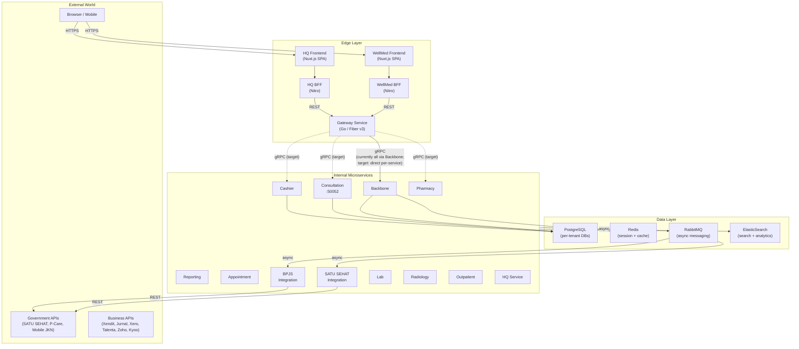
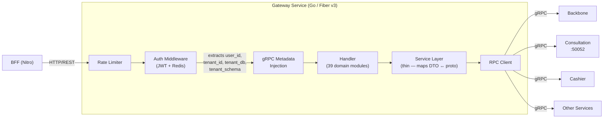
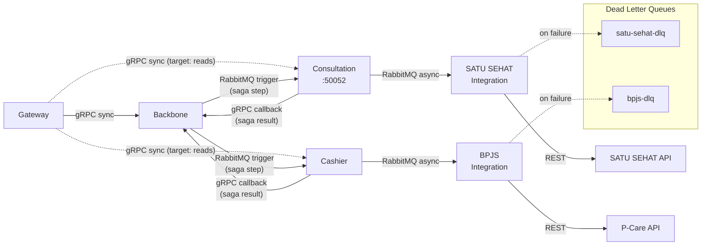
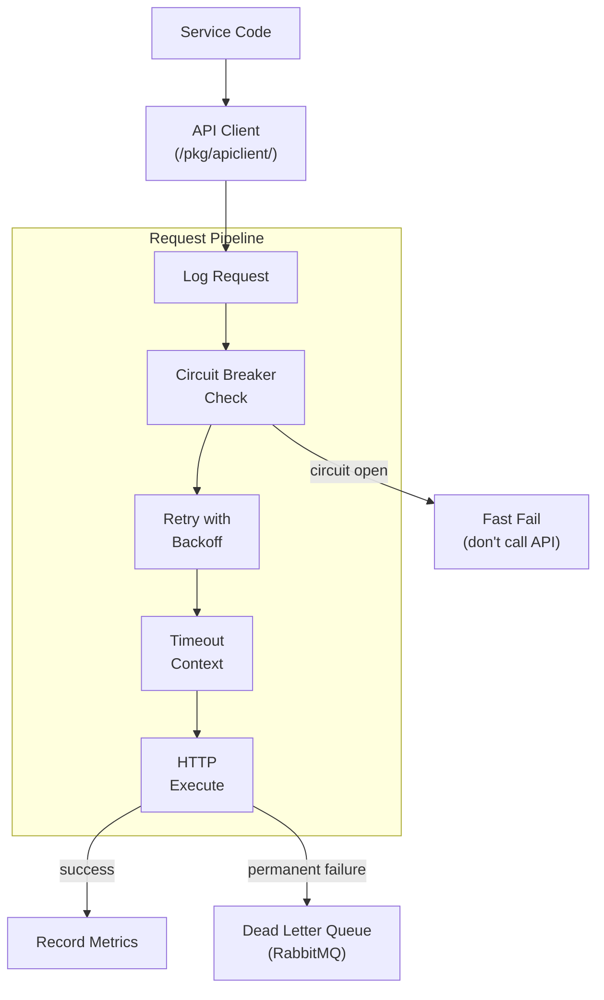
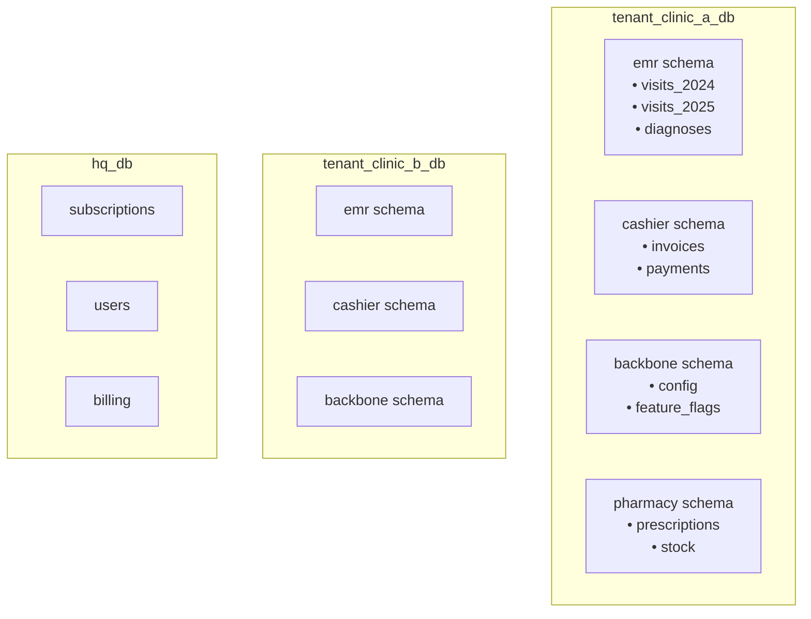
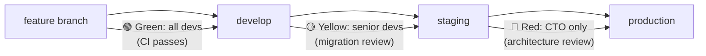

# WellMed System Architecture

**Version:** 1.3
**Date:** 05 March 2026
**Previous Version:** 1.2 (05 March 2026)
**Maintained by:** Alex

### Key Changes v1.2 → v1.3
- SA-7: Renamed "EMR" → "Consultation" throughout diagrams and text to reflect wellmed-consultation service extraction (ADR-002 Phase 1 complete). Added Consultation to Internal Microservices subgraph.

### Key Changes v1.1 → v1.2
- SA-1: Updated Backbone role description to reflect three-role model (canonical model owner, sole saga orchestrator, auth/config) per ADR-005/006.
- SA-2: Updated §2.3.2 Gateway target state to clarify cross-service writes route to Backbone (saga), reads route directly to domain services.
- SA-3: Added RabbitMQ trigger + gRPC callback row to Protocol Matrix.
- SA-4: Replaced §3.2 internal service communication diagram — removed illegal EMR→CASH direct call, added RabbitMQ trigger + gRPC callback pattern (ADR-006).
- SA-5: Replaced §3.2.3 saga orchestrator description with full ADR-005-aligned description.
- SA-6: Marked `/pkg/saga` row as internal to Backbone, not a shared importable package.

---

# 1. System Overview

## 1.1 What WellMed Is

1.1.1 WellMed is a multi-tenant SaaS platform for Indonesian healthcare providers (clinics, hospitals, diagnostic centers). It handles electronic medical records, billing, pharmacy, lab, radiology, appointments, and integrations with Indonesian government health systems (SATU SEHAT, BPJS/P-Care).

1.1.2 The platform ships in three tiers — Lite, Plus, and Enterprise — each adding services on top of the previous tier. A separate HQ service manages subscriptions, billing, and tenant provisioning.

1.1.3 The company behind WellMed is Kalpa Inovasi Digital. "Kalpa" refers to the company and engineering org. "WellMed" refers to the product.

## 1.2 Product Tiers

| Tier | Services | Target |
|------|----------|--------|
| **Lite** | Consultation, Cashier, Reporting, Appointment, Backbone, SATU SEHAT integration, BPJS integration | Small clinics |
| **Plus** | Lite + Pharmacy, Lab, Radiology, Outpatient (multi-department), ED/IGD, Cashier+ (AR/insurance/corporate billing) | Mid-size clinics |
| **Enterprise** | Plus + LIS+, RIS+, MCU, Inpatient, Warehouse/Inventory Management | Hospitals |
| **HQ** | Subscription management, SaaS payments, user management, billing/invoicing | Internal — manages all tenants |

## 1.3 Service Count

| Tier | New Services | Cumulative | Inherits From |
|------|-------------|------------|---------------|
| Lite | 7 | 7 | — |
| Plus | 6 | 13 | Lite |
| Enterprise | 5 | 18 | Plus |
| HQ | 1 (standalone) | — | — |

---

# 2. Architecture Layers

## 2.1 High-Level Request Flow



## 2.2 Layer Definitions

2.2.1 **Edge Layer** — everything between the user's browser and internal microservices. The frontends (Nuxt.js SPAs) serve the UI. The BFFs (Nitro) handle security, session cookies, and reverse-proxy to the Gateway. The Gateway (Go/Fiber v3) is the single entry point for all backend calls — it authenticates via JWT/Redis, rate-limits, translates REST to gRPC, and routes to internal services.

2.2.2 **Internal Microservices** — Go services communicating via gRPC (synchronous) and RabbitMQ (asynchronous). Each service owns its domain: Consultation owns medical records and the full visit lifecycle, Cashier owns billing. Backbone has three roles: (a) canonical domain model owner for `patient`, `user`, `employee`, and system-wide mastering data (ADR-006 §2.1); (b) sole saga orchestrator for all cross-service write operations (ADR-005 §2.1); (c) auth, tenant config, and feature flags. All external API calls (SATU SEHAT, P-Care, Xendit, etc.) originate from dedicated integration services, never from the Gateway.

2.2.3 **Data Layer** — PostgreSQL (per-tenant databases with per-service schemas), Redis (session cache, visit-build cache, type cache, pub/sub for cache invalidation), RabbitMQ (async job processing, external API sync, dead letter queues), ElasticSearch (reporting queries, patient search, analytics).

## 2.3 Gateway Deep Dive

The Gateway deserves its own section because it's the single point of entry and has a unique architecture — it's an HTTP-to-gRPC proxy with no direct database access.



2.3.1 The Gateway has 39 domain modules, each following the same pattern: `handler/` → `service/` → RPC client. There is no repository layer — the Gateway never touches PostgreSQL directly. All data flows through gRPC to internal microservices.

2.3.2 **Current state vs. target state.** As of March 2026, the Gateway routes all gRPC calls to a single Backbone service (one `BACKBONE_GRPC_ADDRESS`). The target architecture has the Gateway routing directly to each domain service (Consultation, Cashier, Pharmacy, etc.) via separate gRPC connections for **read requests and single-service writes**. Cross-service write operations that span domain boundaries are orchestrated by Backbone via saga (ADR-005) — Gateway routes these to Backbone, which coordinates the multi-step flow. Gateway never triggers inter-module calls for write operations that span domains.

2.3.3 Business logic in the Gateway is thin: input validation, default values, timeout handling, and protobuf-to-DTO mapping. The real business logic lives in the domain services (Backbone, Consultation, Cashier, etc.).

2.3.4 Authentication flow: Bearer token extracted → JWT verified against Redis (session store) → claims extracted (user_id, tenant_id, tenant_db, tenant_schema) → injected as gRPC metadata → propagated to all downstream services.

---

# 3. Communication Patterns

## 3.1 Protocol Matrix

| Pattern | When | Example |
|---------|------|---------|
| **gRPC (sync)** | Immediate response needed for UI | Get patient details, create visit |
| **RabbitMQ (async)** | Can wait, needs reliability | Sync visit to SATU SEHAT, process BPJS claim |
| **REST/JSON (external)** | All external API communication | P-Care claims submission, Xendit payment |
| **Redis pub/sub** | Cache invalidation broadcast | Price update notification across services |
| **RabbitMQ trigger + gRPC callback** | Saga step coordination across service boundaries | Visit creation → POS line item push → Backbone callback |

## 3.2 Internal Service Communication



3.2.1 All inter-service sync calls use gRPC with Protocol Buffers. Proto definitions live in `/proto/` and generate typed clients and servers. This gives us type safety, auto-generated documentation, and efficient binary serialization.

3.2.2 All external API calls are async via RabbitMQ. When a visit is created in Consultation, it publishes a message to the SATU SEHAT sync queue. The SATU SEHAT integration service consumes the message, calls the government API, and either confirms success or routes to a dead letter queue on permanent failure.

3.2.3 **Saga Orchestration (ADR-005).** Backbone is the sole saga orchestrator for all cross-service write operations. The pattern:

- **Trigger:** Backbone publishes a RabbitMQ message to trigger each saga step — it never blocks waiting for a response. The message contains the full payload the module needs (ADR-006 §2.3).
- **Callback:** The receiving module processes the step and responds to Backbone via gRPC (`SagaCallbackService.ReportStepResult`) with a standard envelope: `saga_id`, `step_id`, `status` (COMPLETED / FAILED / REJECTED), `payload`, `error_code`.
- **State:** Saga state is persisted in a PostgreSQL audit table (source of truth) with Redis as fast cache. Step-level state tracks `pending → in_flight → completed / failed / compensated`.
- **Compensation:** On step failure or timeout, Backbone executes the compensation sequence for that saga type, rolling back completed steps in reverse order.
- **No business logic in Backbone:** Backbone composes payloads and coordinates steps. Business decisions (e.g., stock availability, billing rules) live in the domain modules. Backbone receives results, not decisions.

See ADR-005 for full details and alternatives considered.

## 3.3 External API Client Pattern

All external API calls use a shared reusable client (`/pkg/apiclient/`) with built-in resilience:



3.3.1 **Policy groups** govern retry/timeout behavior per API category:

| Policy Group | APIs | Retries | Circuit Threshold | Timeout |
|-------------|------|---------|-------------------|---------|
| critical-gov | SATU SEHAT, P-Care | 10 | 10 failures | 60s |
| standard-gov | Mobile JKN | 5 | 5 failures | 45s |
| payments | Xendit | 3 | 3 failures | 30s |
| business | Jurnal, Xero, Talenta | 5 | 5 failures | 30s |
| notifications | Zoho Desk, Kyoo | 2 | 3 failures | 15s |

3.3.2 The circuit breaker prevents hammering failing services. After reaching the threshold, it opens and fast-fails all requests for a cooldown period. It then enters half-open state, allowing one test request through to check if the service has recovered.

3.3.3 Dead letter queues capture every permanently failed request (all retries exhausted). These go to RabbitMQ DLQs with full request context for manual review and replay. No data is ever lost.

---

# 4. Data Architecture

## 4.1 Multi-Tenant Database Strategy



4.1.1 **Separate database per tenant.** Each clinic/hospital gets its own PostgreSQL database. This eliminates tenant_id filtering concerns entirely — a query in `tenant_clinic_a_db` can never accidentally return data from another tenant.

4.1.2 **Schema per service within each tenant DB.** Inside a tenant database, each microservice gets its own schema (emr, cashier, pharmacy, backbone, etc.). This provides logical separation without the overhead of separate databases per service.

4.1.3 **Tables clustered by year.** High-volume tables (visits, invoices) are partitioned by year (e.g., `visits_2024`, `visits_2025`) to keep index sizes manageable and create headroom for growth.

4.1.4 **HQ database is standalone.** The HQ service manages subscriptions, user accounts, and SaaS billing in its own database, separate from tenant databases.

## 4.2 Caching Strategy (Redis)

| Cache Type | Purpose | Invalidation |
|------------|---------|-------------|
| Session cache | JWT session storage, auth state | TTL-based (token expiry) |
| Shared type cache | Lookup tables (ICD codes, drug catalogs) | Pub/sub broadcast on update |
| Visit build cache | In-progress visit data before save | Explicit clear on visit completion |
| Transaction cache | Bill accumulation during visit before settlement | Explicit clear on payment |

## 4.3 Search & Analytics (ElasticSearch)

4.3.1 ElasticSearch handles reporting queries and patient search. Data is synced from PostgreSQL asynchronously — it is not the source of truth.

4.3.2 Use cases: full-text patient search, aggregate reporting dashboards, analytics queries that would be too slow on PostgreSQL.

---

# 5. Infrastructure

## 5.1 AWS Environment

5.1.1 All infrastructure runs on AWS. Hamzah owns all infrastructure: VMs, CloudWatch, X-Ray, Secrets Manager, PostgreSQL, Redis, RabbitMQ, ElasticSearch.

5.1.2 Three environments: development, staging, production. Staging mirrors production topology. Dev is minimal.

## 5.2 Observability Stack

| Tool | Purpose |
|------|---------|
| **CloudWatch** | Log aggregation (JSON logs via uber-go/zap), metrics, alarms |
| **AWS X-Ray** | Distributed request tracing across services |
| **AWS Secrets Manager** | API tokens, credentials, secret rotation |
| **Service `/health` endpoints** | Standardized health checks polled every 60s |

## 5.3 Response Time SLOs

| Threshold | Level | Action |
|-----------|-------|--------|
| < 200ms | Green | Normal |
| 200–500ms | Yellow | Monitor |
| 500–1000ms | Orange | Investigate |
| > 1000ms | Red | Alert |

## 5.4 Backup Strategy

| Environment | Asset | Frequency | Retention |
|-------------|-------|-----------|-----------|
| Production | DB WAL | Continuous | 7 days |
| Production | DB snapshot | Daily | 14 days |
| Production | Full snapshot (app + frontend) | Weekly or pre-upgrade | Last 4 copies |
| Staging | DB snapshot | Weekly | 2 weeks |
| Staging | Config/structure | Git (IaC) | Forever |
| Dev | None | — | — |

---

# 6. Code Organization

## 6.1 Repository Structure

6.1.1 Each service has its own Git repository. The Gateway repo is `wellmed-gateway-go`. Service repos follow the naming pattern `wellmed-{service-name}` (e.g., `wellmed-backbone`, `wellmed-consultation`).

6.1.2 A dedicated `kalpa-docs` repo holds all cross-service documentation: this architecture document, ADRs, testing strategy, API client patterns, and system diagrams. Service repos link back to `kalpa-docs` for system-level context. (See the repo governance document for details on what lives where.)

## 6.2 Service Internal Structure

Every service follows the same four-layer pattern. This consistency means any developer can navigate any service immediately.

```
/internal/domain/{module}/
├── handler/          # Layer 1: Request/Response (30% coverage target)
│   ├── {module}_handler.go
│   └── {module}_handler_test.go
├── service/          # Layer 2: Business Logic (80% coverage target)
│   ├── {module}_service.go
│   └── {module}_service_test.go
├── repository/       # Layer 3: Database Access (integration tests only)
│   └── {module}_repo.go
└── dto/              # Layer 4: Data structures
    └── {module}_request.go
```

6.2.1 **Exception: Gateway.** The Gateway has no repository layer because it doesn't access the database. Its service layer is thin (DTO ↔ protobuf mapping + input validation). The handler layer does the heavy lifting of HTTP routing and middleware integration.

## 6.3 Shared Packages (`/pkg/`)

| Package | Purpose |
|---------|---------|
| `/pkg/apiclient` | Reusable HTTP client with circuit breaker, retry, DLQ (see Section 3.3) |
| `/pkg/saga` | ~~Shared saga package~~ — Saga orchestrator is internal to Backbone (`internal/saga/`), not a shared importable package. Consultation holds a local copy for Phase 1 (ADR-002 §5.2). Extraction to a shared module is deferred. |
| `/pkg/queue` | RabbitMQ utilities |
| `/pkg/domain/cache` | Redis caching utilities |
| `/pkg/domain/validation` | Common validators (NIK, phone number, etc.) |
| `/pkg/domain/types` | Shared types (Money, DateTime) |
| `/pkg/domain/logging` | Structured logging utilities (zap wrappers) |
| `/pkg/testutil` | Test utilities, mock generators, test helpers |

---

# 7. CI/CD & Branch Governance

## 7.1 Pipeline

7.1.1 CI runs on GitHub Actions. Three workflows: lint (`golangci-lint`), unit tests (8-minute timeout), integration tests (12-minute timeout, spins up Postgres/Redis/RabbitMQ containers). Total build budget: 15 minutes.

7.1.2 Every PR gets a Claude-assisted review summary (auto-posted as a comment, Indonesian default language).

7.1.3 ADRs are drafted by Claude and approved by the CTO as part of the PR process for architectural changes.

## 7.2 Branch & Merge Rules



| Level | Scope | Who Can Merge | Requirements |
|-------|-------|---------------|-------------|
| Green | Minor changes, bug fixes | All developers | CI passes |
| Yellow | Database migrations | Senior devs (Fajri, Hamzah) | Green + migration review |
| Red | New modules, major features, prod deploy | CTO only | Yellow + architecture review |

## 7.3 Testing Coverage Targets

| Layer | Minimum Coverage | Rationale |
|-------|-----------------|-----------|
| Handler | 30% | Mostly plumbing; integration tests catch bugs |
| Service | 80% | Business logic lives here; bugs hurt most |
| Domain/Utilities | 50% | Important but less critical than business logic |
| Repository | Via integration tests | Need real DB to test SQL meaningfully |

---

# 8. Security Boundaries

8.1.1 **Authentication**: JWT tokens verified against Redis session store at the Gateway. Every request past the Gateway carries authenticated user context as gRPC metadata.

8.1.2 **Tenant isolation**: Enforced at the database level (separate databases). The tenant_db and tenant_schema are extracted from JWT claims and propagated via gRPC metadata. Services connect to the correct tenant database based on these values.

8.1.3 **Secrets management**: All API tokens and credentials stored in AWS Secrets Manager. No hardcoded credentials in code.

8.1.4 **Rate limiting**: Configured at the Gateway level to prevent runaway API calls and abuse.

8.1.5 **External API auth**: OAuth2 token management for government APIs (SATU SEHAT, P-Care). Token refresh handled by the integration services.

---

# 9. Key Technology Choices

| Area | Choice | Notes |
|------|--------|-------|
| Backend language | Go | All microservices |
| Frontend framework | Nuxt.js | Both WellMed and HQ SPAs |
| BFF framework | Nitro | Server-side rendering + reverse proxy |
| HTTP framework (Gateway) | Fiber v3 | High-performance Go HTTP |
| Inter-service RPC | gRPC + Protocol Buffers | Type safety, auto-generated docs, binary efficiency |
| Async messaging | RabbitMQ | Job processing, external API sync, event-driven |
| Primary database | PostgreSQL | Per-tenant, per-service schemas, year-partitioned tables |
| Cache | Redis | Sessions, type cache, visit build, pub/sub |
| Search/Analytics | ElasticSearch | Reporting, patient search |
| Logging | uber-go/zap (JSON) | Structured logs → CloudWatch |
| Tracing | AWS X-Ray | Distributed request tracing |
| CI/CD | GitHub Actions | Lint, test, build pipelines |
| IDs | ULID (oklog/ulid/v2) | Sortable, timestamp-embedded, collision-resistant |

---

# 10. Document Relationships

This architecture overview is the root document. Related documents provide depth on specific topics:

| Document | Scope | Location |
|----------|-------|----------|
| **This document** | System-wide architecture overview | `kalpa-docs/wellmed-system-architecture.md` |
| **Testing Architecture & Strategy** | Testing values, patterns, coverage targets, CI config | `kalpa-docs/wellmed-testing-architecture.md` |
| **API Client Pattern** | `/pkg/apiclient` design, implementation, ADR | `kalpa-docs/wellmed-api-client-pattern.md` |
| **Working Document** | Consolidated decisions, work plan, ADR template | `kalpa-docs/wellmed-working-document.md` |
| **Gateway PLAN** | Gateway-specific documentation, testing, CI/CD dry-run | `kalpa-gateway/PLAN.md` (lives in service repo) |
| **Kalpa Documentation PRD** | Meta-plan for establishing docs/testing culture | `kalpa-docs/kalpa-documentation-testing-prd.md` |
| **ADRs** | Individual architecture decision records | `kalpa-docs/adrs/ADR-XXX.md` |
| **Repo Governance** | What docs live where across repos | `kalpa-docs/repo-governance.md` |

---

# Edit Log

| Version | Date | Author | Changes |
|---------|------|--------|---------|
| 1.0 | 01 Mar 2026 | Alex + Claude | Initial creation. Consolidated architecture sections from testing-architecture-v5, api-client-pattern-v1, working-document-v2, and gateway PLAN-v2 into a standalone system architecture reference. Added mermaid diagrams for all major flows. |
| 1.1 | 01 Mar 2026 | Alex + Claude | Fixed Gateway routing model (current: all via Backbone; target: direct per-service). Confirmed 18 Enterprise services. Added QUESTIONS.md cross-reference for team discussion. |
| 1.2 | 05 Mar 2026 | Alex + Claude | SA-1 through SA-6: Updated Backbone role to three-role model; updated Gateway target state; added RabbitMQ+gRPC callback to protocol matrix; replaced internal comms diagram (removed ADR-006-violating EMR→CASH direct call); replaced saga description with ADR-005-aligned detail; marked /pkg/saga as internal to Backbone. |
| 1.3 | 05 Mar 2026 | Alex + Claude | SA-7: Renamed EMR → Consultation throughout to reflect ADR-002 Phase 1 completion. Updated product tier table, mermaid diagrams, service descriptions. |
